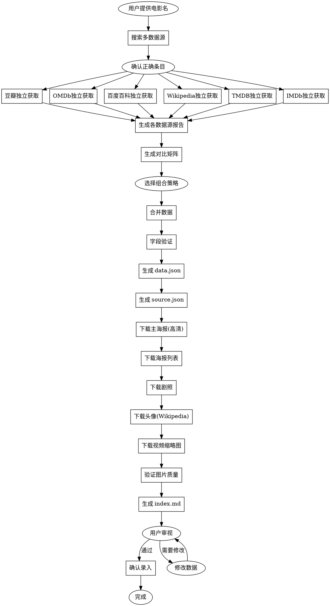

# Skill 优化建议

> 历史说明：本文是旧 file-first 方案下的优化提案。
> 其中关于数据源对比、图片质量、字段校验的建议仍可复用；涉及 `data.json` / `source.json` / `index.md` 作为最终产物的部分，现已被 SQLite 主源方案取代。

## 第2部影片过程中遇到的问题

### 问题1：主海报质量不合格
**现象**：`poster-main.jpg` 使用了 OMDb 的低质量小图（71 KB），而非豆瓣高清海报（1061.7 KB）

**原因**：
- 工作流中未明确主海报必须使用高清版本
- OMDb 海报质量参差不齐，不应作为主海报来源

**解决方案**：
```markdown
### 6. 下载图片素材

**主海报优先级**：
1. 豆瓣正式海报（中国大陆优先）
2. 豆瓣正式海报（美国）
3. 豆瓣海报列表第一张
4. ❌ 不使用 OMDb 海报作为主海报（质量不稳定）

**验证标准**：
- 主海报文件大小必须 > 200 KB
- 如果 < 200 KB，必须替换为豆瓣高清版本
```

---

### 问题2：图片尺寸不统一
**现象**：旧版 `index.md` 审阅稿中的图片展示尺寸不一致，有的带说明文字，有的不带

**原因**：
- 缺少统一的图片展示尺寸规范
- 不同类型图片的容器宽度和图片尺寸未标准化

**解决方案**：
新增 `IMAGE-SIZE-STANDARD.md` 文档，定义：
- 主演头像：容器 120px，图片 100x100px
- 海报：容器 160px，图片 160px宽
- 剧照：容器 200px，图片 200px宽
- 视频缩略图：容器 280px，图片 280px宽
- 主海报（顶部）：200px宽，带阴影

---

### 问题3：视频缩略图未下载
**现象**：视频缩略图显示为空白或占位符

**原因**：
- 豆瓣预告片页面需要 Playwright 访问
- 缩略图 URL 需要解析预告片页面获取

**解决方案**：
```markdown
### 视频缩略图获取

**方法**：
1. 访问豆瓣预告片页面：`https://movie.douban.com/trailer/{id}/`
2. 提取视频封面图 URL
3. 下载并命名为 `video-trailer-NN.png`

**备选方案**：
- 如果无法获取缩略图，使用表格链接形式展示
- 标注"视频缩略图待补充"
```

---

### 问题4：演职员头像来源不明确
**现象**：豆瓣头像需要单独下载，但工作流未说明头像获取方法

**原因**：
- 豆瓣演职员页面头像有防盗链
- Wikipedia 是更好的头像来源，但未在工作流中体现

**解决方案**：
```markdown
### 演职员头像获取

**优先级**：
1. Wikipedia（无防盗链，质量高）
2. 豆瓣演职员页面（需带 Referer）
3. IMDb（访问受限，不推荐）

**Wikipedia 头像获取方法**：
1. 查询演员 Wikipedia 页面：`/api/rest_v1/page/summary/{actor_name}`
2. 提取 `thumbnail.source` 字段
3. 直接下载（无防盗链）
```

---

### 问题5：数据源获取流程不清晰
**现象**：实际操作中不知道应该从哪些数据源获取哪些字段

**原因**：
- 工作流只说了"运行爬虫脚本"，未说明每个数据源能获取什么
- 缺少数据源对比矩阵

**解决方案**：
新增 `DATA-SOURCE-COMPARISON.md` 文档，包含：
- 各数据源可获取字段矩阵
- 字段覆盖对比表
- 推荐组合策略
- 数据冲突处理规则

---

### 问题6：缺少数据源完整获取流程
**现象**：用户希望先从各数据源独立获取完整数据，再对比选择

**原因**：
- 当前工作流直接合并数据，缺少独立获取和对比环节
- 无法追溯哪些字段从哪个数据源获取

**解决方案**：
```markdown
### 新增步骤：数据源独立获取与对比

**流程**：
1. 从每个数据源独立获取完整数据
2. 生成各数据源的完整数据文件：
   - raw/douban-full.json
   - raw/omdb-full.json
   - raw/baike-full.json
   - raw/wikipedia-full.json
   - raw/tmdb-full.json
   - raw/imdb-full.json
3. 生成各数据源的获取报告：
   - raw/douban-report.md
   - raw/omdb-report.md
   - ...
4. 生成最终对比报告：
   - raw/final-summary.md（字段覆盖矩阵）
5. 根据对比结果选择组合策略
6. 合并数据生成 data.json
```

---

### 问题7：图片防盗链处理不明确
**现象**：豆瓣图片直接下载返回 418 错误

**原因**：
- 工作流未说明防盗链处理方法
- 缺少 PowerShell 下载示例

**解决方案**：
```markdown
### 图片下载技术要点

**豆瓣图片（有防盗链）**：
```powershell
Invoke-WebRequest -Uri $url -OutFile $outFile -Headers @{Referer="https://movie.douban.com/"}
```

**Wikipedia 图片（无防盗链）**：
```powershell
Invoke-WebRequest -Uri $url -OutFile $outFile
```

**验证下载成功**：
- 检查文件大小 > 0
- 海报应 > 200 KB
- 剧照应 > 100 KB
```

---

### 问题8：缺少字段验证环节
**现象**：生成的 data.json 可能缺少必填字段或字段值异常

**原因**：
- 工作流未定义必填字段列表
- 缺少字段验证逻辑

**解决方案**：
```markdown
### 字段验证

**必填字段**：
- id, title, originalTitle, year
- director, genre, country, runtime
- imdbId, doubanId
- synopsis.text

**验证规则**：
- year: 1900-2030
- runtime: 60-300 分钟
- doubanRating: 0-10
- 文件大小: 海报 > 200KB

**缺失字段处理**：
- 标记为 `null`
- 在导入摘要或临时溯源文件中记录无法获取原因
- 在最终报告中列出缺失字段
```

---

## 旧方案目录结构（历史提案）

```
.opencode/skills/movie-entry-workflow/
├── SKILL.md                         # 工作流主文档
├── FIELD-SOURCE-MAPPING.md          # 字段与数据源映射规则
├── IMAGE-SIZE-STANDARD.md           # 图片展示尺寸规范 ✨新增
├── DATA-SOURCE-COMPARISON.md        # 数据源对比矩阵 ✨新增
├── FIELD-VALIDATION.md              # 字段验证规则 ✨新增
└── crawlers/                        # 爬虫脚本
    ├── douban-movie.js
    ├── imdb.js
    ├── baidu-baike.js
    └── README.md

site/public/assets/video/movie/{ID}/ # 当前作品静态资源主目录
.local/                              # 当前 SQLite 本地数据库目录
temp/raw/                            # 可选：抓取阶段临时原始数据目录
```

---

## 旧方案工作流程（历史提案）



---

## 可复用结论

| 问题 | 解决方案 | 新增文档 |
|------|----------|----------|
| 主海报质量不合格 | 明确主海报必须用豆瓣高清版 | 更新 SKILL.md |
| 图片尺寸不统一 | 定义标准尺寸规范 | IMAGE-SIZE-STANDARD.md |
| 视频缩略图未下载 | 添加获取方法和备选方案 | 更新 SKILL.md |
| 头像来源不明确 | 明确 Wikipedia 优先 | 更新 SKILL.md |
| 数据源流程不清晰 | 添加对比矩阵 | DATA-SOURCE-COMPARISON.md |
| 缺少独立获取环节 | 新增 raw/ 目录和报告 | 更新 SKILL.md |
| 防盗链处理不明确 | 添加 PowerShell 示例 | 更新 SKILL.md |
| 缺少字段验证 | 定义必填字段和验证规则 | FIELD-VALIDATION.md |
