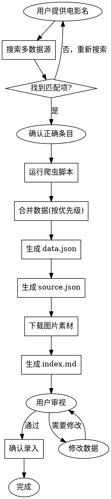

# 电影录入工作流

## 概述

严谨的电影数据录入流程：搜索确认 → 数据源预检测 → 多源爬取 → 数据溯源 → 生成 JSON → 下载素材 → 生成 MD → 用户确认 → 缺失字段追踪

**核心原则**：
1. 每个字段都必须有来源记录，数据可追溯、可审计
2. data.json 与 index.md 字段必须同步（参考 `DATA-TO-MD-MAPPING.md`）
3. 所有有数据的字段都必须在 index.md 中展示（参考 `INDEX-MD-TEMPLATE.md`）
4. `story` 必须忠于公开可证实内容：已上映作品写完整剧情，未上映作品只写公开剧情梗概，禁止补写未公开内容

## 目录结构

```
.opencode/skills/movie-entry-workflow/
├── SKILL.md                    # 本文档
├── FIELD-SOURCE-MAPPING.md     # 字段与数据源映射规则
├── DATA-SOURCE-COMPARISON.md   # 数据源对比矩阵
├── FIELD-VALIDATION.md         # 字段验证规则
├── IMAGE-SIZE-STANDARD.md      # 图片展示尺寸规范
├── INDEX-MD-TEMPLATE.md        # index.md 必须展示字段模板
├── DATA-TO-MD-MAPPING.md       # data.json 到 index.md 映射规则
├── TMDB-ID-MAP.md              # TMDB ID 映射表（新增）
└── crawlers/                   # 爬虫脚本
    ├── douban-movie.js         # 豆瓣电影爬虫
    ├── imdb.js                 # IMDb 爬虫
    ├── baidu-baike.js          # 百度百科爬虫
    └── README.md               # 爬虫使用说明

content/video/movie/{ID}/
├── data.json                   # 数据文件
├── source.json                 # 溯源文件（与 data.json 一一对应）
├── index.md                    # 展示文档
├── images/                     # 图片素材
└── raw/                        # 原始数据（可选保留）
    ├── douban.json             # 豆瓣原始数据
    ├── omdb.json               # OMDb 原始数据
    ├── baike.json              # 百度百科原始数据
    ├── wikipedia.json          # Wikipedia 原始数据
    ├── tmdb.json               # TMDB 原始数据（如有）
    ├── imdb.json               # IMDb 原始数据（如有）
    └── final-summary.md        # 最终对比报告
```

## 工作流程



## 步骤详解

### 1. 搜索电影

**输入**：电影名（中文或英文）

**搜索策略**：按优先级尝试多种关键词组合

1. **完整中文名搜索**：优先使用用户提供的完整中文名
2. **英文名 + 年份搜索**：如果知道年份，加上年份限定
3. **关键词组合搜索**：主演名 + 电影类型 + 年份
4. **模糊搜索**：去掉标点、空格后再搜索

**操作**：使用 Playwright 登录豆瓣后搜索

```javascript
// 搜索关键词组合
const keywords = [
  "迈克尔·杰克逊：巨星之路",      // 完整中文名
  "Michael 2026",                 // 英文名 + 年份
  "迈克尔·杰克逊 传记",           // 关键词组合
  "Michael Jackson 电影"          // 模糊搜索
];

// 依次尝试，直到找到匹配项
for (const keyword of keywords) {
  const results = await searchDouban(keyword);
  if (results.length > 0) {
    // 展示候选列表，让用户确认
    return results;
  }
}
```

**豆瓣搜索 URL**：
- `https://movie.douban.com/subject_search?search_text={关键词}`

**IMDb 搜索 URL**：
- `https://www.imdb.com/find/?q={关键词}&s=tt`

**注意**：
- 豆瓣搜索需要登录 cookie，否则会触发验证
- 如果搜索无结果，尝试简化关键词（去掉标点、年份等）
- 搜索结果按相关度排序，取前 5 个展示给用户

**输出**：候选列表（含来源标识、标题、年份、类型），让用户确认正确条目

### 1.5 数据源预检测（新增）

**目的**：提前发现不可用的数据源，避免浪费时间

**检测方法**：

| 数据源 | 检测方式 | 预期结果 |
|--------|----------|----------|
| 豆瓣 | 访问电影主页 | 200 OK 或需要登录 |
| OMDb | 调用 API | 200 OK + 数据 |
| 百度百科 | 访问词条页 | 200 OK |
| Wikipedia | 调用 REST API | 200 OK |
| TMDB | 调用 API | 200 OK 或 404（未收录） |
| IMDb | 尝试访问页面 | 200 OK 或 403（被禁止） |

**检测脚本示例**：

```powershell
# OMDb 检测
$omdbUrl = "https://www.omdbapi.com/?i=tt11378946&apikey=YOUR_KEY"
$omdbResponse = Invoke-RestMethod $omdbUrl
if ($omdbResponse.Response -eq "True") {
    Write-Host "OMDb: ✅ 可用"
} else {
    Write-Host "OMDb: ❌ 不可用"
}

# TMDB 检测
$tmdbUrl = "https://api.themoviedb.org/3/find/tt11378946?api_key=YOUR_KEY&external_source=imdb_id"
try {
    $tmdbResponse = Invoke-RestMethod $tmdbUrl
    if ($tmdbResponse.movie_results.Count -gt 0) {
        Write-Host "TMDB: ✅ 已收录"
    } else {
        Write-Host "TMDB: ❌ 未收录"
    }
} catch {
    Write-Host "TMDB: ❌ API错误"
}
```

**输出**：数据源可用性报告

```markdown
## 数据源可用性

| 数据源 | 状态 | 备注 |
|--------|------|------|
| 豆瓣 | ✅ 可用 | 需要登录 Cookie |
| OMDb | ✅ 可用 | API Key 有效 |
| 百度百科 | ✅ 可用 | 词条存在 |
| Wikipedia | ✅ 可用 | 页面存在 |
| TMDB | ❌ 未收录 | 电影未入库 |
| IMDb | ❌ 受限 | 直接访问被禁止 |
```

**决策**：根据可用性报告，调整数据源优先级和获取策略

### 2. 运行爬虫脚本

**必读**：先查阅 `FIELD-SOURCE-MAPPING.md` 了解字段优先级规则

**执行**：
```bash
# 豆瓣爬虫
node crawlers/douban-movie.js --id 1292052 --output raw-douban.json

# IMDb 爬虫
node crawlers/imdb.js --id tt0111161 --output raw-imdb.json

# 百度百科爬虫（可选）
node crawlers/baidu-baike.js --title "肖申克的救赎" --output raw-baike.json
```

**输出**：每个爬虫生成一个原始数据文件，包含：
- 爬取时间
- 数据来源 URL
- 原始数据（未合并）

### 3. 合并数据（按优先级）

**规则**：参考 `FIELD-SOURCE-MAPPING.md`

**合并逻辑**：
1. 读取各爬虫的原始数据文件
2. 按 FIELD-SOURCE-MAPPING 定义的字段优先级合并
3. 记录每个字段的最终来源

**冲突处理**：
- 中文数据：豆瓣 > 百度百科 > IMDb（翻译）
- 英文数据：IMDb > 豆瓣
- 评分数据：豆瓣评分用豆瓣，IMDb 评分用 IMDb
- 演职员：豆瓣（中文名）+ IMDb（英文名/头像）

### 4. 生成 data.json

**路径**：`content/video/movie/{ID}/data.json`

**ID 规则**：`MMSSNNNNNN`
- MM = 01（影视模块）
- SS = 01（电影子模块）
- NNNNNN = 递增序号（查询现有最大 ID + 1）

**结构**：见附录 A

### 5. 生成 source.json

**路径**：`content/video/movie/{ID}/source.json`

**作用**：记录每个字段的来源，与 data.json 一一对应

**结构示例**：
```json
{
  "title": {
    "value": "肖申克的救赎",
    "source": "douban",
    "sourceUrl": "https://movie.douban.com/subject/1292052/",
    "crawledAt": "2026-05-01T15:30:00Z",
    "crawlerScript": "douban-movie.js"
  },
  "originalTitle": {
    "value": "The Shawshank Redemption",
    "source": "imdb",
    "sourceUrl": "https://www.imdb.com/title/tt0111161/",
    "crawledAt": "2026-05-01T15:30:00Z",
    "crawlerScript": "imdb.js"
  },
  "year": {
    "value": 1994,
    "source": "douban",
    "sourceUrl": "https://movie.douban.com/subject/1292052/",
    "crawledAt": "2026-05-01T15:30:00Z",
    "crawlerScript": "douban-movie.js"
  },
  "cast": {
    "value": [...],
    "source": "merged",
    "sources": [
      {
        "source": "douban",
        "fields": ["name", "role"],
        "sourceUrl": "https://movie.douban.com/subject/1292052/celebrities"
      },
      {
        "source": "imdb",
        "fields": ["nameEn", "avatar"],
        "sourceUrl": "https://www.imdb.com/title/tt0111161/fullcredits"
      }
    ],
    "crawledAt": "2026-05-01T15:30:00Z"
  }
}
```

### 6. 下载图片素材

**目录**：`content/video/movie/{ID}/images/`

**命名规则**：
- 海报：`poster-01.png`, `poster-02.png`, ..., `poster-main.jpg`
- 剧照：`still-01.png`, `still-02.png`, ...
- 壁纸：`wallpaper-01.png`, `wallpaper-02.png`, ...
- 头像：`avatar-{姓名拼音}.png`
- 视频封面：`video-trailer-01.png`

**图片爬取优先级**（重要！）：
1. **TMDB**（首选）：无防盗链，自动化程度高
2. 豆瓣：有防盗链，需要 Referer
3. IMDb：有反爬机制

**主海报优先级**：
1. 豆瓣正式海报（中国大陆优先）
2. 豆瓣正式海报（美国）
3. TMDB 第一张海报
4. ❌ **禁止使用 OMDb 海报作为主海报**（质量不稳定，通常 < 100KB）

**主海报验证标准**：
- 文件大小必须 > 200 KB
- 如果 < 200 KB，必须替换为豆瓣/TMDB 高清版本
- 推荐大小：500 KB - 3 MB

**下载策略**：
- 主海报：豆瓣正式海报 > Wikipedia > TMDB
- 海报列表：**TMDB**（前 10 张，不包含主海报）
- 剧照：**TMDB backdrops**（前 13 张）
- 壁纸：豆瓣（前 4 张）
- 头像：导演 + 主演（前 8 位），优先从 Wikipedia 获取

**下载技术要点**：

豆瓣图片（有防盗链）：
```powershell
Invoke-WebRequest -Uri $url -OutFile $outFile -Headers @{Referer="https://movie.douban.com/"}
```

Wikipedia 图片（无防盗链）：
```powershell
Invoke-WebRequest -Uri $url -OutFile $outFile
```

TMDB 图片（无防盗链，推荐）：
```powershell
# 1. 获取 TMDB ID（通过 IMDb ID）
# 阿甘正传 TMDB ID = 13

# 2. 爬取海报页面
Invoke-WebRequest -Uri "https://www.themoviedb.org/movie/{TMDB_ID}/images/posters" -OutFile tmdb-posters.html

# 3. 提取图片 URL
$matches = [regex]::Matches($content, 'https://image\.tmdb\.org/t/p/original/[^"]+\.jpg')

# 4. 下载图片
Invoke-WebRequest -Uri $url -OutFile $outFile
```

**TMDB 图片爬取流程**（自动化推荐）：

**步骤 1：获取 TMDB ID**
```powershell
# 方法 1：通过 TMDB 搜索页面爬取
$searchUrl = "https://www.themoviedb.org/search/movie?query=Forrest+Gump"
Invoke-WebRequest -Uri $searchUrl -OutFile tmdb-search.html
# 正则提取第一个结果的 ID：/movie/(\d+)

# 方法 2：常见电影 TMDB ID 映射表
$tmdbIdMap = @{
    "tt0111161" = 278  # 肖申克的救赎
    "tt0109830" = 13   # 阿甘正传
    "tt0110413" = 1104 # 这个杀手不太冷
}
```

**步骤 2：爬取海报**
```powershell
# 访问海报页面
$posterUrl = "https://www.themoviedb.org/movie/{TMDB_ID}/images/posters"
Invoke-WebRequest -Uri $posterUrl -OutFile tmdb-posters.html

# 提取图片 URL
$content = Get-Content tmdb-posters.html -Raw
$matches = [regex]::Matches($content, 'https://image\.tmdb\.org/t/p/original/[^"]+\.jpg')
$urls = $matches | ForEach-Object { $_.Value } | Select-Object -Unique

# 下载前 10 张
$urls | Select-Object -First 10 | ForEach-Object { 
    Invoke-WebRequest -Uri $_ -OutFile "poster-$i.jpg" 
}
```

**步骤 3：爬取剧照（backdrops）**
```powershell
# 访问剧照页面
$backdropUrl = "https://www.themoviedb.org/movie/{TMDB_ID}/images/backdrops"
Invoke-WebRequest -Uri $backdropUrl -OutFile tmdb-backdrops.html

# 提取并下载（同上）
```

**TMDB ID 查询方式**：
- **自动查询**：爬取 TMDB 搜索页面，提取第一个结果的 ID
- **API 查询**：`https://api.themoviedb.org/3/find/{IMDB_ID}?api_key={KEY}&external_source=imdb_id`（需要 API key）
- **手动查询**：访问 themoviedb.org 搜索电影名
- **常见电影 TMDB ID 映射表**：
  - 肖申克的救赎：278
  - 阿甘正传：13
  - 这个杀手不太冷：1104
  - 泰坦尼克号：597
  - 盗梦空间：27205

**来源记录**：每张图片在 source.json 中记录下载 URL

### 7. 生成 index.md

**路径**：`content/video/movie/{ID}/index.md`

**内容**：从 data.json 渲染，包含：
- 基本信息（海报 + 信息列表）
- 剧情简介
- 详情介绍
- 演职员信息（横向卡片布局）
- 视频预览
- 图片画廊
- 音乐原声带
- 相似作品
- 精选影评
- 关联链接
- 数据来源说明（底部）

内容规则：

- `synopsis` 只用于短简介
- `story` 用于详情页完整剧情
- `reviews` 必须优先来自豆瓣长评页或人工筛选后的高质量评语

`story` 录入规则：

- 已上映作品：`story` 应覆盖主要人物、关键转折与结局，不能只扩写 `synopsis`。
- 未上映 / 未公开完整剧情作品：`story` 只能整理公开剧情物料、人物关系与已公开阶段性内容，不能伪造后续事件。
- 未上映 / 未公开完整剧情作品：必须在 `story.note` 与 `source.json.story.note` 写明“基于公开剧情物料整理，非完整剧情/非完整人生全程”。

**图片展示规范**：参考 `IMAGE-SIZE-STANDARD.md`
- 主演头像：容器 120px，图片 100x100px
- 海报：容器 160px，图片 160px宽
- 剧照：容器 200px，图片 200px宽
- 视频缩略图：容器 280px，图片 280px宽
- 主海报（顶部）：200px宽，带阴影

**视频缩略图获取**：
1. 访问豆瓣预告片页面：`https://movie.douban.com/trailer/{id}/`
2. 提取视频封面图 URL
3. 下载并命名为 `video-trailer-NN.png`
4. **降级方案**：如果 Playwright 失败，使用表格链接形式展示

**视频缩略图降级方案**：

如果缩略图下载失败，使用表格形式展示视频：

```markdown
## 视频

| 标题 | 时长 | 链接 |
|------|------|------|
| 中国大陆预告片1：终极版 | 01:00 | [观看](https://movie.douban.com/trailer/324247/) |
| 中国大陆预告片2：定档版 | 00:30 | [观看](https://movie.douban.com/trailer/324145/) |
```

### 8. 数据完整性检查

**自动对比**：与已录入影片对比，提示缺失字段

**对比维度**：
1. **图片数量**：海报、剧照、头像数量
2. **演职员数量**：主演、其他演员数量
3. **音乐原声**：曲目数量
4. **影评数量**：精选长评数量

**对比示例**：
```
=== 数据完整性检查 ===

对比影片：肖申克的救赎（0101000001）

| 维度 | 肖申克 | 当前影片 | 差距 |
|------|--------|----------|------|
| 海报 | 11张 | 11张 | ✅ |
| 剧照 | 13张 | 39张 | ✅ 更多 |
| 头像 | 8张 | 8张 | ✅ |
| otherCast | 17人 | 14人 | ⚠️ 接近 |
| soundtrack | 16首 | 32首 | ✅ 更多 |
| 影评 | 5条 | 5条 | ✅ |

结论：数据完整，可以提交审视
```

**缺失字段提示**：
- 如果差距 > 30%，提示用户确认
- 如果差距 > 50%，建议补充数据

### 9. 用户审视

**展示**：
1. 输出 `data.json` 关键字段摘要
2. 输出 `source.json` 来源统计（各数据源贡献）
3. 输出 `index.md` 路径
4. 输出图片下载统计
5. 输出缺失字段汇总
6. **输出数据完整性检查结果**（与已录入影片对比）

**验证检查**：
- 主海报文件大小 > 200 KB
- 必填字段完整性
- 图片数量统计
- **数据完整性对比**

**询问**：
```
请审视以上内容：
- 数据来源：豆瓣、OMDb、百度百科、Wikipedia、TMDB
- 字段溯源：见 source.json
- 缺失字段：见 raw/final-summary.md
- 数据完整性：见对比结果

确认录入？[确认/需要修改/放弃]
```

### 10. 确认录入

**操作**：
- 用户确认后，输出完成信息
- 删除临时文件（raw-douban.json 等）
- 保留 data.json、source.json、index.md、images/

### 11. 缺失字段后续补充（新增）

**触发条件**：
- 数据源暂时不可用（如 TMDB 未收录）
- 数据未出炉（如 IMDb 评分）
- 图片下载失败（如演员头像无来源）

**处理方式**：

1. **在 source.json 中记录 retryAfter 日期**：

```json
{
  "imdbRating": {
    "value": null,
    "status": "⚠️ 暂无数据",
    "note": "IMDb评分尚未出炉（电影刚上映）",
    "retryAfter": "2026-06-01"
  },
  "tmdbId": {
    "value": null,
    "status": "❌ 无法获取",
    "note": "TMDB数据库未收录此电影",
    "retryAfter": "2026-07-01"
  },
  "cast[2].avatar": {
    "value": null,
    "status": "⚠️ 部分缺失",
    "note": "Juliano Valdi 在Wikipedia无独立页面",
    "retryAfter": null
  }
}
```

2. **在 index.md 中标记"待补充"**：

```markdown
<small style="color: #888;">（头像待补充）</small>
```

3. **生成 TODO.md 列出待补充项**：

```markdown
# 待补充字段

| 字段 | 状态 | 原因 | 重试日期 |
|------|------|------|----------|
| imdbRating | ⚠️ 暂无 | 评分未出炉 | 2026-06-01 |
| tmdbId | ❌ 无数据 | TMDB未收录 | 2026-07-01 |
| Juliano Valdi 头像 | ⚠️ 部分缺失 | 无Wikipedia页面 | 手动补充 |
```

4. **设置提醒**：在重试日期后再次运行数据获取流程

**补充流程**：

```bash
# 1个月后重新获取 IMDb 评分
node crawlers/omdb.js --id tt11378946 --output raw-omdb-update.json

# 更新 data.json 和 source.json
# 标记 imdbRating.status = "✅ 已补充"
```

## 附录 A：data.json 完整结构

```json
{
  "id": "0101000001",
  "title": "肖申克的救赎",
  "originalTitle": "The Shawshank Redemption",
  "year": 1994,
  "director": [
    {
      "name": "弗兰克·德拉邦特",
      "nameEn": "Frank Darabont",
      "avatar": "avatar-frank-darabont.png",
      "works": ["肖申克的救赎", "绿里奇迹", "迷雾"]
    }
  ],
  "writer": [...],
  "cast": [...],
  "otherCast": [...],
  "producer": [...],
  "genre": ["剧情", "犯罪"],
  "country": "美国",
  "language": "英语",
  "runtime": 142,
  "releaseDate": [...],
  "aka": [...],
  "imdbId": "tt0111161",
  "doubanId": "1292052",
  "doubanRating": 9.7,
  "doubanVotes": 3281603,
  "imdbRating": 9.3,
  "imdbVotes": 2800000,
  "synopsis": {
    "text": "...",
    "note": "..."
  },
  "videos": [...],
  "images": {
    "poster": "poster-main.jpg",
    "posters": [...],
    "stills": [...],
    "wallpapers": [...]
  },
  "soundtrack": {
    "name": "The Shawshank Redemption (Original Motion Picture Soundtrack)",
    "composer": "托马斯·纽曼",
    "composerEn": "Thomas Newman",
    "year": 1994,
    "tracks": [
      { "index": 1, "name": "Introduction", "duration": "0:04" }
    ]
  },
  "similar": [...],
  "reviews": [...],
  "links": {
    "douban": "https://movie.douban.com/subject/1292052/",
    "imdb": "https://www.imdb.com/title/tt0111161/",
    "tmdb": null
  },
  "module": "video",
  "submodule": "movie",
  "createdAt": "2026-05-01",
  "updatedAt": "2026-05-01"
}
```

说明：

- `images.poster` 永远表示主海报
- `images.posters` 表示补充海报列表，后续录入时不应再重复包含主海报
- `images.postersTotal` 表示补充海报总数，不包含主海报本身
- `images.stillsTotal` 表示源站可获取剧照总量，不等于本地已下载剧照数量
- `images.wallpapers` 表示壁纸文件列表；允许为空数组
- `source.json.images.avatars` 可作为聚合来源字段，记录本地已下载头像文件列表及其来源
- `links.*` 缺失时统一使用 `null`
- `soundtrack.name` 表示原声带专辑名
- `soundtrack.tracks[]` 中曲目名统一使用 `name`

## 附录 B：source.json 完整结构

```json
{
  "id": {
    "value": "0101000001",
    "source": "system",
    "note": "系统自动生成"
  },
  "title": {
    "value": "肖申克的救赎",
    "source": "douban",
    "sourceUrl": "https://movie.douban.com/subject/1292052/",
    "crawledAt": "2026-05-01T15:30:00Z",
    "crawlerScript": "douban-movie.js"
  },
  "originalTitle": {
    "value": "The Shawshank Redemption",
    "source": "imdb",
    "sourceUrl": "https://www.imdb.com/title/tt0111161/",
    "crawledAt": "2026-05-01T15:30:00Z",
    "crawlerScript": "imdb.js"
  },
  "year": {...},
  "director": {...},
  "cast": {
    "value": [...],
    "source": "merged",
    "sources": [
      {
        "source": "douban",
        "fields": ["name", "role"],
        "sourceUrl": "https://movie.douban.com/subject/1292052/celebrities"
      },
      {
        "source": "imdb",
        "fields": ["nameEn", "avatar"],
        "sourceUrl": "https://www.imdb.com/title/tt0111161/fullcredits"
      }
    ],
    "crawledAt": "2026-05-01T15:30:00Z"
  },
  "images": {
    "poster": {
      "value": "poster-main.jpg",
      "source": "douban",
      "sourceUrl": "https://movie.douban.com/subject/1292052/",
      "downloadedFrom": "https://img2.doubanio.com/view/photo/l_ratio_poster/public/p480747492.jpg",
      "crawledAt": "2026-05-01T15:30:00Z"
    },
    "posters": {
      "value": [
        "poster-01.png",
        "poster-02.png"
      ],
      "source": "tmdb",
      "sourceUrl": "https://www.themoviedb.org/movie/278/images/posters",
      "crawledAt": "2026-05-01T15:35:00Z",
      "note": "补充海报列表，不包含主海报"
    },
    "postersTotal": {
      "value": 149,
      "source": "douban",
      "sourceUrl": "https://movie.douban.com/subject/1292052/photos?type=R",
      "crawledAt": "2026-05-01T15:35:00Z",
      "note": "源站可获取的补充海报总量，不等于本地已下载文件数量"
    },
    "stills": {
      "value": [
        "still-01.png",
        "still-02.png"
      ],
      "source": "tmdb",
      "sourceUrl": "https://www.themoviedb.org/movie/278/images/backdrops",
      "crawledAt": "2026-05-01T15:40:00Z",
      "note": "本地已下载的剧照文件列表"
    },
    "stillsTotal": {
      "value": 918,
      "source": "douban",
      "sourceUrl": "https://movie.douban.com/subject/1292052/photos?type=S",
      "crawledAt": "2026-05-01T15:40:00Z",
      "note": "源站可获取的剧照总量，不等于本地已下载文件数量"
    }
  },
  "createdAt": {
    "value": "2026-05-01",
    "source": "system",
    "note": "录入时间"
  }
}
```

## 常见问题

### Q: 数据源冲突怎么办？

A: 参考 FIELD-SOURCE-MAPPING.md 的优先级规则，按字段类型决定

### Q: 爬虫失败怎么办？

A: 记录失败原因，继续其他数据源，最后汇总缺失字段

### Q: 图片下载失败怎么办？

A: 记录失败 URL，继续流程，最后汇总失败项，可手动补充

### Q: 用户修改数据怎么办？

A: 修改 data.json，同步更新 source.json（标记为 manual 编辑）

### Q: TMDB ID 如何查询？

A: 参考 TMDB-ID-MAP.md，优先使用映射表，其次自动爬取搜索页面

### Q: 图片爬取优先级？

A: **TMDB > 豆瓣 > IMDb**，TMDB 无防盗链，自动化程度最高

## 更新记录

| 日期 | 变更 |
|------|------|
| 2026-05-02 | 收紧 `story` 录入边界，要求未上映作品显式标注“基于公开剧情物料整理” |
| 2026-05-01 | 添加数据完整性检查步骤；添加 TMDB-ID-MAP.md；优化图片爬取优先级 |
| 2026-05-01 | 添加 TMDB 图片爬取方案；添加 rated、awards、runtimeEn 字段展示 |
| 2026-05-01 | 初始版本 |

## 常见问题

**用户**：录入电影《肖申克的救赎》

**助手**：
```
1. 搜索多数据源...
   - 豆瓣：找到 1 个匹配项（ID: 1292052）
   - IMDb：找到 1 个匹配项（ID: tt0111161）
   
2. 确认条目？[确认]

3. 运行爬虫脚本...
   - douban-movie.js → raw-douban.json ✓
   - imdb.js → raw-imdb.json ✓
   
4. 合并数据（按 FIELD-SOURCE-MAPPING 规则）...

5. 生成文件：
   - data.json → content/video/movie/0101000001/data.json
   - source.json → content/video/movie/0101000001/source.json
   
6. 下载图片... 海报 11 张，剧照 13 张，壁纸 4 张，头像 9 张

7. 生成 index.md → content/video/movie/0101000001/index.md

数据来源统计：
- 豆瓣：title, year, genre, cast.name, synopsis, doubanRating...
- IMDb：originalTitle, imdbRating, cast.nameEn...

请审视以上内容，确认录入？
```
