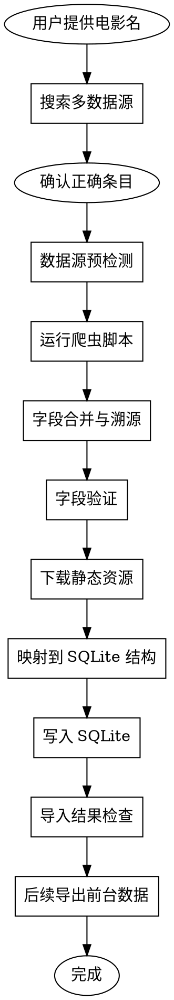

# 电影录入工作流

## 概述

当前项目的电影录入主流程已经切换为 **DB-first**：

```text
多源搜索/抓取 -> 字段合并与校验 -> 下载静态资源 -> 写入 SQLite -> 导出前台产物 -> Astro 构建
```

其中：

- SQLite 是唯一结构化数据主源
- Astro 前台不直接读取数据库，而是消费导出产物
- `data.json` / `source.json` / `index.md` 不再是当前主流程的最终标准产物
- 旧模板文档保留为兼容参考，仅用于迁移旧数据或人工审阅草稿时参考

## 当前目标

这个 workflow 现在的职责是：

1. 搜索并确认正确电影条目
2. 检查各数据源可用性
3. 抓取多源原始数据
4. 按字段优先级合并并校验数据
5. 下载作品资源与共享人物头像
6. 将规范化后的数据写入 SQLite
7. 输出导入结果、缺失项与待补充项
8. 为后续导出脚本提供稳定主源

## 核心原则

1. 每个字段都必须可追溯，至少要能说明最终值来自哪个数据源
2. SQLite 是唯一结构化数据主源，目录下 JSON/Markdown 草稿都不能替代数据库
3. 静态资源直接写入 `site/public/assets/`，不维护第二份镜像目录
4. 旧的 `index.md` 展示模板只作为兼容参考，不再驱动当前数据结构设计
5. `story` 必须忠于公开可证实内容：已上映作品可整理完整剧情，未上映作品只能整理公开梗概，禁止补写未公开内容

## 当前主链路对应文件

- 数据库设计：`docs/DATABASE.md`
- SQLite 初始化：`tools/db/init.sql`
- 当前电影导入脚本：`tools/db/import-movies.mjs`
- DB 工具说明：`tools/db/README.md`

## 资源路径规则

### 作品私有资源

- 路径：`site/public/assets/video/movie/{id}/`
- 示例：`site/public/assets/video/movie/0101000001/poster-main.jpg`

### 共享人物资源

- 路径：`site/public/assets/people/`
- 命名：`{person_code}-avatar{ext}`
- 示例：`site/public/assets/people/p000001-avatar.jpg`

## 目录中的文档如何理解

### 仍然是当前有效参考的文档

- `FIELD-SOURCE-MAPPING.md`
- `DATA-SOURCE-COMPARISON.md`
- `FIELD-VALIDATION.md`
- `IMAGE-SIZE-STANDARD.md`
- `crawlers/README.md`

这些文档仍然有价值，但它们服务的是：

- 数据源选择
- 字段优先级
- 字段校验
- 图片抓取与质量标准

而不是定义最终落库形态。

### 已降级为旧兼容参考的文档

- `INDEX-MD-TEMPLATE.md`
- `DATA-TO-MD-MAPPING.md`

这些文档保留原因：

- 项目里已有早期 `content/video/movie/*/data.json` 样本
- 旧 workflow 以 `index.md` 人工审阅为中心
- 迁移旧数据时仍可能需要对照旧字段语义

但它们不再代表当前主流程的目标产物。

## 当前推荐工作流程



## 步骤详解

### 1. 搜索并确认电影

输入：电影名（中文或英文）

搜索策略：

1. 完整中文名
2. 英文名 + 年份
3. 主演 / 类型 / 年份组合
4. 去标点后的模糊搜索

目标不是马上生成文件，而是先确认：

- 豆瓣条目是否正确
- IMDb ID 是否正确
- 目标作品是否已存在于站内数据库

### 2. 数据源预检测

优先检查：

- 豆瓣是否可访问
- OMDb API 是否可用
- 百度百科词条是否存在
- Wikipedia 页面是否存在
- TMDB 是否已收录
- IMDb 是否可直接访问或只能通过代理数据补充

这一步用于决定后续抓取策略和字段优先级微调。

### 3. 运行爬虫脚本

当前可复用脚本：

- `crawlers/douban-movie.js`
- `crawlers/imdb.js`
- `crawlers/baidu-baike.js`

当前建议将各数据源结果先保存为临时原始文件或内存对象，用于：

- 差异比对
- 字段合并
- 排查抓取失败

这些原始文件是过渡工件，不是站点主数据。

### 4. 字段合并与溯源

规则以 `FIELD-SOURCE-MAPPING.md` 为准。

当前需要保留的不是“最终 `source.json` 文件”本身，而是“字段来源能力”：

- 最终值来自哪个数据源
- 是否发生冲突
- 冲突时为何选择当前值
- 哪些字段仍缺失、应在何时回补

建议保留的最小溯源能力：

- `source`
- `source_url`
- `crawled_at`
- `conflicts`
- `note`

这些信息可以在当前阶段先保留为临时汇总 JSON、日志或导入摘要，后续再决定是否进入数据库附表。

### 5. 字段验证

规则以 `FIELD-VALIDATION.md` 为准。

当前验证关注三类问题：

1. 必填字段是否齐全
2. 值是否合理
3. 文本边界是否合规

特别注意：

- `story.text` 不能只是把 `synopsis.text` 扩写一遍
- 未上映作品的 `story.note` 必须明确写出内容边界
- 主海报必须优先保证清晰度，不能拿 OMDb 小图充数

### 6. 下载静态资源

资源下载仍然是这个 workflow 的核心环节，但路径已切换：

- 作品资源下载到 `site/public/assets/video/movie/{id}/`
- 人物头像下载到 `site/public/assets/people/`

资源命名建议仍可沿用旧规范：

- `poster-main.jpg`
- `poster-01.jpg`
- `still-01.jpg`
- `wallpaper-01.jpg`

但人物头像命名必须对齐数据库人物内部编号，而不是姓名拼音：

- 推荐：`p000001-avatar.jpg`
- 不再推荐：`avatar-tim-robbins.png`

图片来源优先级与质量规则继续参考：

- `FIELD-SOURCE-MAPPING.md`
- `IMAGE-SIZE-STANDARD.md`

### 7. 映射到 SQLite 结构

合并后的电影数据需要映射到以下 5 张核心表：

1. `works`
2. `people`
3. `work_credits`
4. `terms`
5. `work_terms`

当前映射方向以 `docs/DATABASE.md` 为准。

电影当前重点落位：

- 一对一字段 -> `works`
- 演职员 -> `people` + `work_credits`
- 类型 / 标签 -> `terms` + `work_terms`
- 强绑定展示信息 -> `works` 中的 JSON 字段

### 8. 写入 SQLite

当前落地方式以现有 DB 工具链为准：

- 初始化：`tools/db/init.sql`
- 导入：`tools/db/import-movies.mjs`

在当前过渡阶段，如果中间仍然需要生成规范化 JSON 供脚本消费，它也只是导入中间层，不是最终主源。

### 9. 导入结果检查

导入后至少检查：

- `works` 中作品记录是否存在
- `people` 是否生成稳定 `person_code`
- `work_credits` 是否正确区分导演 / 编剧 / 主演 / 原著等关系
- `terms` / `work_terms` 是否成功挂载类型
- 静态资源路径是否与数据库记录一致

### 10. 待补充字段管理

如果某些字段暂缺，不再要求必须生成 `TODO.md` 或 `source.json` 才算完成。

当前更重要的是明确记录：

- 缺什么
- 为什么缺
- 是暂时不可用还是永久缺失
- 是否需要稍后重试

建议最少输出一份本次导入摘要，包含：

- 成功写入的作品 ID
- 使用到的数据源
- 资源下载统计
- 缺失字段清单
- 建议回补时间

## 与旧 workflow 的关系

### 仍然保留的能力

- 多源搜索
- 字段优先级合并
- 差异比对与冲突说明
- 图片抓取与质量校验
- 缺失字段跟踪

### 已不再作为主流程目标的产物

- `content/video/movie/{id}/source.json`
- `content/video/movie/{id}/index.md`
- 以目录内 `images/` 作为唯一资源主目录

### 当前允许的过渡做法

为了兼容现有样本与迁移阶段脚本，仍可临时生成：

- 原始抓取 JSON
- 规范化中间 JSON
- 人工审阅摘要 Markdown

但这些都必须服从一个原则：

**最终以 SQLite 中的数据与 `site/public/assets/` 中的资源为准。**

## 当前阶段结论

这个 skill 现在不应再被理解为：

- “生成一套 `data.json + source.json + index.md` 目录即可完成录入”

而应理解为：

- “完成一次有溯源能力的电影抓取、校验、资源下载与 SQLite 入库，并为后续导出前台产物提供稳定主源”
