# 肖申克的救赎 The Shawshank Redemption (1994)

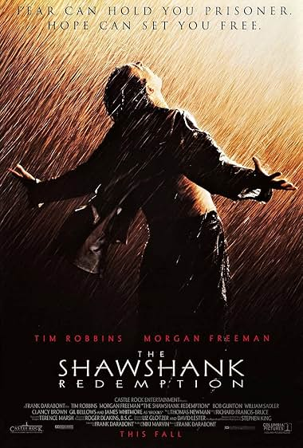

**导演**：弗兰克·德拉邦特

**编剧**：弗兰克·德拉邦特 / 斯蒂芬·金

**主演**：蒂姆·罗宾斯 / 摩根·弗里曼 / 鲍勃·冈顿 / 威廉·赛德勒 / 克兰西·布朗

**类型**：剧情 / 犯罪

**制片国家/地区**：美国

**语言**：英语

**上映日期**：1994-09-10(多伦多电影节) / 1994-10-14(美国)

**片长**：142分钟

**又名**：月黑高飞(港) / 刺激1995(台) / 地狱诺言 / 铁窗岁月 / 消香克的救赎

**IMDb**：tt0111161

**豆瓣评分**：**9.7** / 3,281,603人评价

---

## 剧情简介

银行家安迪被误判入狱，在肖申克监狱与瑞德结下深厚友谊，并凭借冷静头脑在高墙之内为自己争取生存空间。

当翻案希望被再次掐灭，他把多年隐忍、智慧与信念化为一场惊人的自我救赎，也让瑞德重新相信自由并非遥不可及。

本片获得1995年奥斯卡最佳影片等7项提名。

---

## 详情介绍

1947年，年轻银行家安迪·杜佛兰因妻子及其情人被杀一案被判无期徒刑，押入肖申克监狱。沉默寡言的他很快引起老囚犯瑞德的注意，并通过瑞德弄到石锤、海报等小物件，在残酷秩序里一点点建立自己的生存方式。面对"姐妹帮"的欺凌、狱警的暴力和监狱制度的冷酷，安迪始终没有放弃对尊严的维护。

凭借金融与税务知识，安迪先后帮助狱警处理报税问题，也被典狱长诺顿拿来经营账目、洗白黑钱。与此同时，他推动扩建图书馆、为囚犯争取读物和教育机会，让肖申克这座高墙之内第一次出现了真正意义上的精神空间。老布出狱后的崩溃与自尽，也让安迪和瑞德更清楚"体制化"对人的吞噬。

后来，年轻囚犯汤米提供了可能证明安迪清白的关键线索。安迪满怀希望去找诺顿申诉，却发现典狱长为了保住自己的利益，宁可枪杀证人，也不愿让他重获自由。所有合法翻案的道路被堵死后，安迪把多年隐忍转化为最后一次行动。

一个暴雨之夜，瑞德才明白石锤、海报与地质学兴趣背后藏着怎样漫长而坚定的计划：安迪用近二十年时间凿开牢墙，沿着下水道逃出生天，并顺手将诺顿的犯罪证据寄给媒体和检察机关。典狱长自尽、狱警被捕，安迪则以假身份取走存款，前往太平洋海边的芝华塔内霍等待新生活。

多年后获假释的瑞德违背"不再越界"的承诺，依照安迪留下的线索找到一笔钱和一封信，终于鼓起勇气踏出被制度驯化的人生。他穿越边境来到海边，与正在修船的安迪重逢。

---

## 演职员信息

### 导演

 
<strong>弗兰克·德拉邦特</strong> 
<small>Frank Darabont</small>

**代表作**：肖申克的救赎、绿里奇迹、迷雾

### 编剧

| 姓名 | 外文名 | 角色 | 百科链接 |
|------|--------|------|----------|
| 弗兰克·德拉邦特 | Frank Darabont | 编剧 | [百度百科](https://baike.baidu.com/item/弗兰克·德拉邦特) |
| 斯蒂芬·金 | Stephen King | 原著 | [百度百科](https://baike.baidu.com/item/斯蒂芬·金) |

### 主演

 
<strong>蒂姆·罗宾斯</strong> 
<small>Tim Robbins</small> 
<small>饰 安迪·杜佛兰</small>

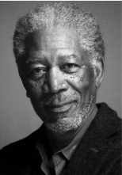 
<strong>摩根·弗里曼</strong> 
<small>Morgan Freeman</small> 
<small>饰 瑞德</small>

 
<strong>鲍勃·冈顿</strong> 
<small>Bob Gunton</small> 
<small>饰 监狱长诺顿</small>

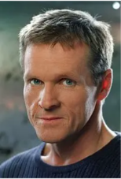 
<strong>威廉·赛德勒</strong> 
<small>William Sadler</small> 
<small>饰 海伍德</small>

 
<strong>克兰西·布朗</strong> 
<small>Clancy Brown</small> 
<small>饰 上尉哈德利</small>

 
<strong>吉尔·贝罗斯</strong> 
<small>Gil Bellows</small> 
<small>饰 汤米</small>

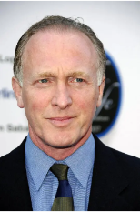 
<strong>马克·罗斯顿</strong> 
<small>Mark Rolston</small> 
<small>饰 包格斯</small>

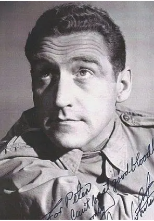 
<strong>詹姆斯·惠特摩</strong> 
<small>James Whitmore</small> 
<small>饰 老布</small>

### 其他演员

| 姓名 | 外文名 | 饰演角色 |
|------|--------|----------|
| 杰弗里·德曼 | Jeffrey DeMunn | 1946地方检察官 |
| 拉里·布兰登伯格 | Larry Brandenburg | 斯基特 Skeet |
| 尼尔·吉恩托利 | Neil Giuntoli | 基格 Jigger |
| 布赖恩·利比 | Brian Libby | 弗洛依德 Floyd |
| 大卫·普罗瓦尔 | David Proval | 瞌睡虫 Snooze |
| 约瑟夫·劳格诺 | Joseph Ragno | 厄尼 Ernie |
| 祖德·塞克利拉 | Jude Ciccolella | 守卫梅特 Guard Mert |
| 保罗·麦克兰尼 | Paul McCrane | 守卫特劳特 Guard Trout |
| 芮妮·布莱恩 | Renee Blaine | 安迪·杜佛兰的妻子 |
| 阿方索·弗里曼 | Alfonso Freeman | 新囚犯 Fresh Fish Con |
| V·J·福斯特 | V.J. Foster | 囚犯 Hungry Fish Con |
| 弗兰克·梅德拉诺 | Frank Medrano | 肥仔 Fat Ass |
| 马克·迈尔斯 | Mack Miles | 蒂雷尔 Tyrell |
| 尼尔·萨默斯 | Neil Summers | 皮特 Pete |
| 耐德·巴拉米 | Ned Bellamy | 守卫扬布拉德 Guard Youngblood |
| 布赖恩·戴拉特 | Brian Delate | 守卫德金斯 Guard Dekins |
| 唐·麦克马纳斯 | Don McManus | 守卫威利 Guard Wiley |

### 制片人

| 姓名 | 外文名 | 百科链接 |
|------|--------|----------|
| 妮基·马文 | Niki Marvin | [百度百科](https://baike.baidu.com/item/妮基·马文) |

---

## 视频

 
<strong>预告片1：25周年经典重映</strong> 
<small>时长：01:30 | [豆瓣](https://movie.douban.com/trailer/259258/)</small>

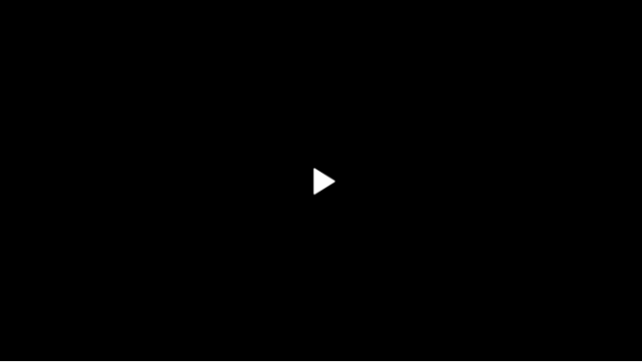 
<strong>预告片2</strong> 
<small>时长：02:13 | [豆瓣](https://movie.douban.com/trailer/108756/)</small>

---

## 图片

> 所有图片位于 `images/` 目录下

### 海报（补充海报已下载10张，豆瓣共149张）

 

 

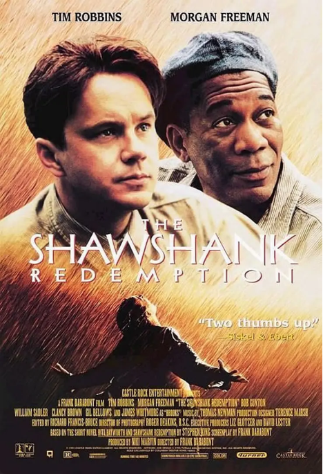 

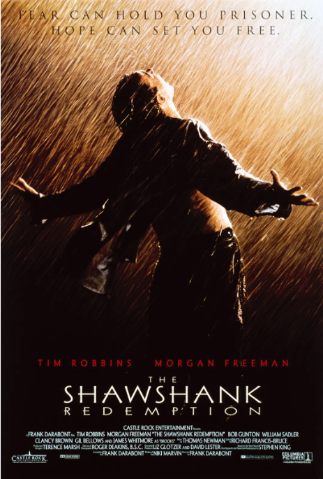 

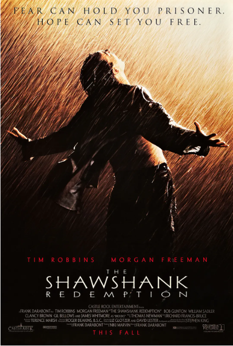 

 

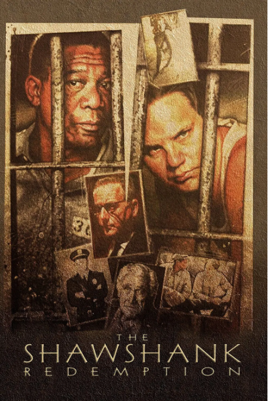 

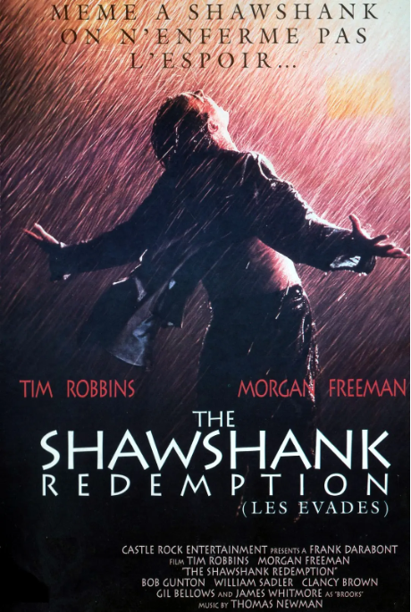 

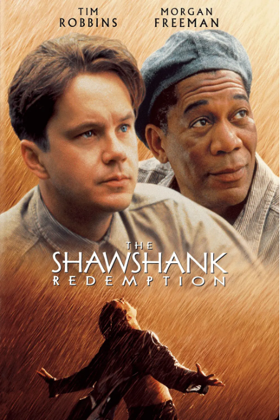 

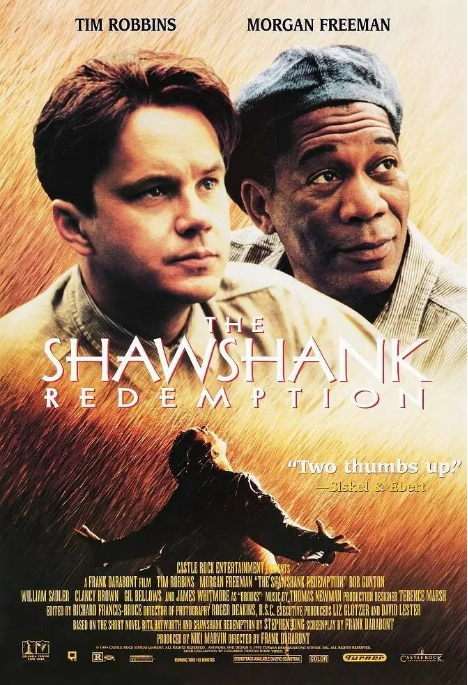 

> [查看全部海报](https://movie.douban.com/subject/1292052/photos?type=R)

### 剧照（已下载13张，豆瓣共918张）

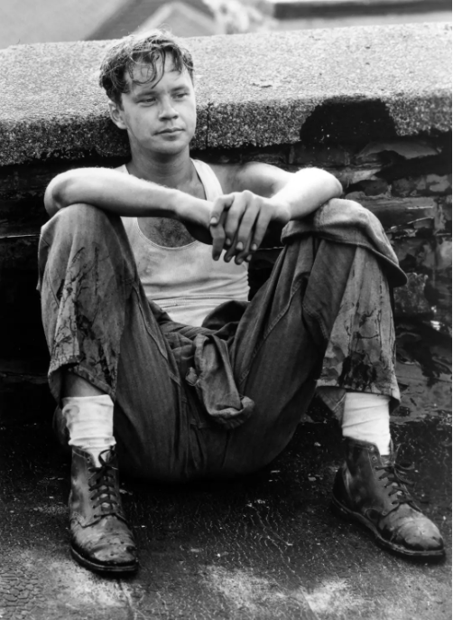 

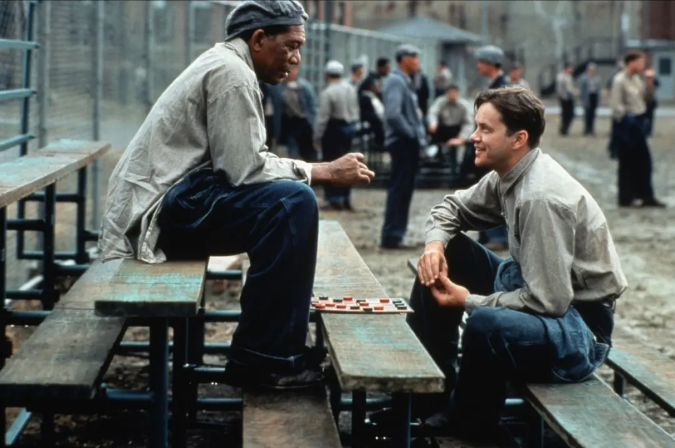 

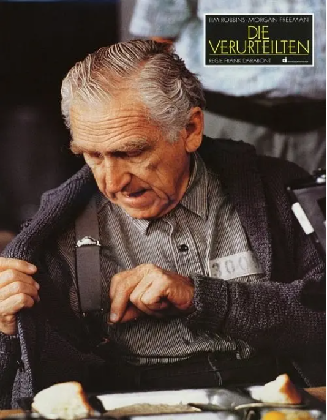 

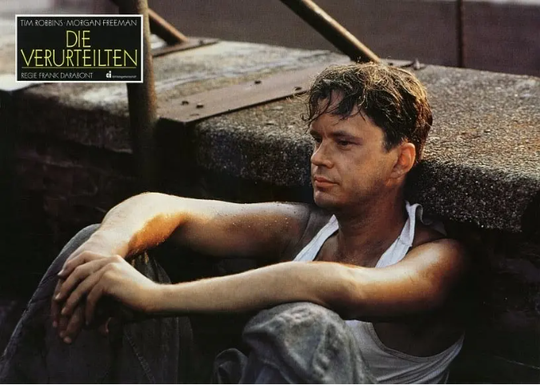 

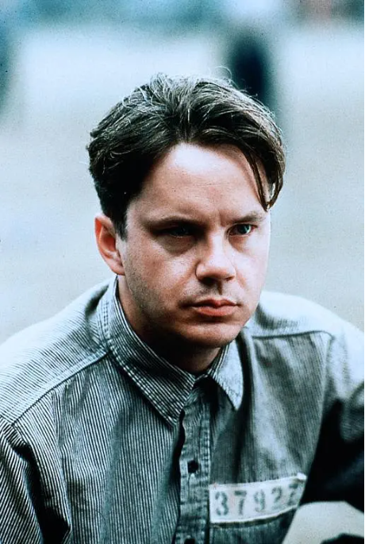 

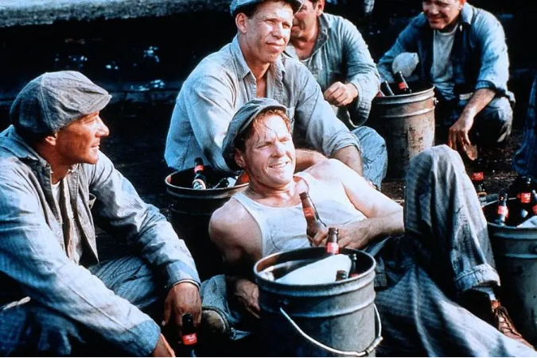 

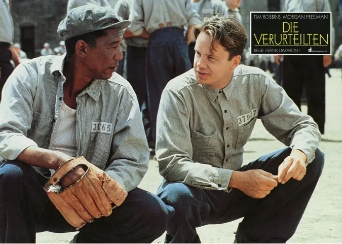 

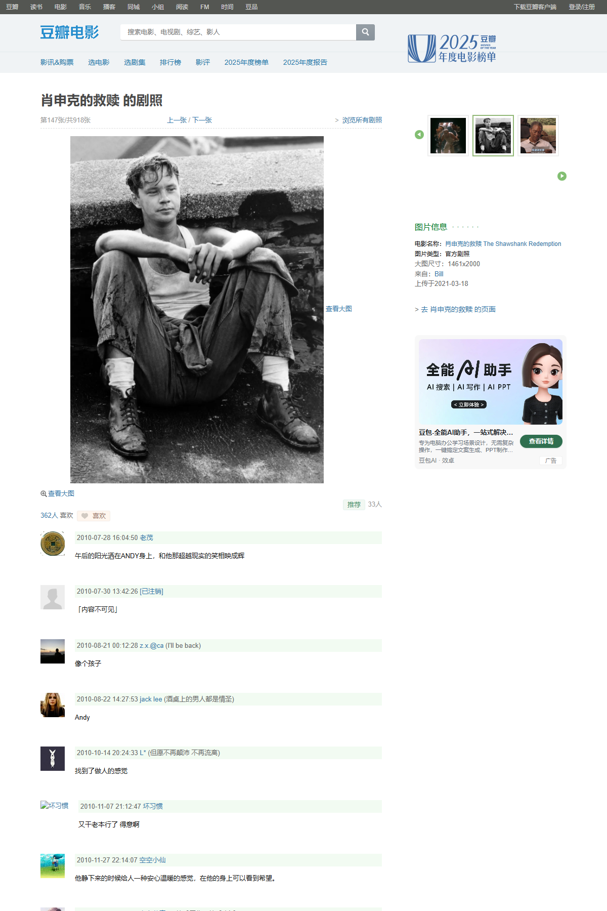 

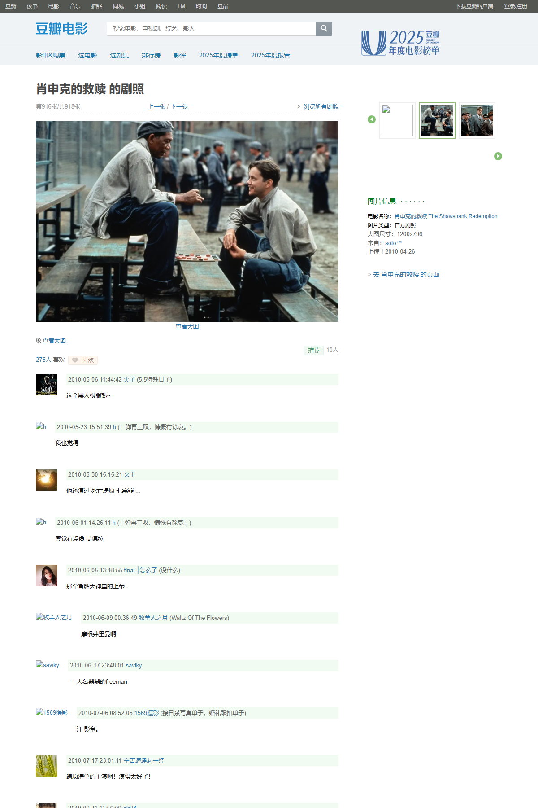 

 

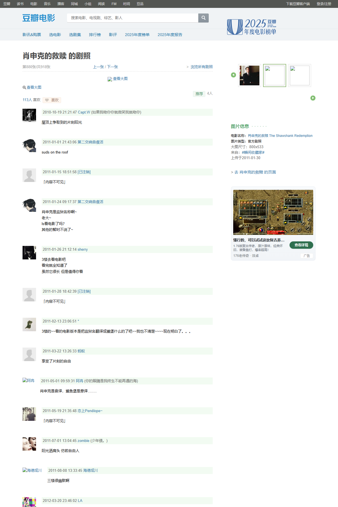 

 

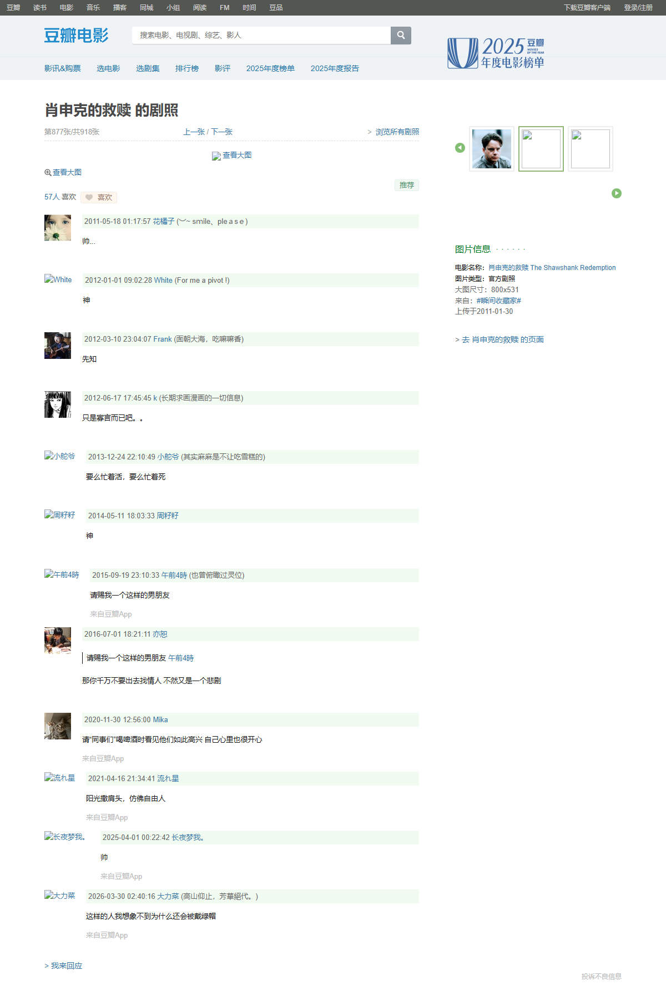 

> [查看全部剧照](https://movie.douban.com/subject/1292052/photos?type=S)

### 壁纸（已下载4张）

 

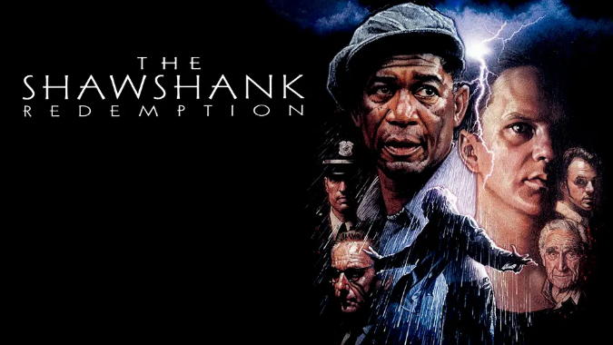 

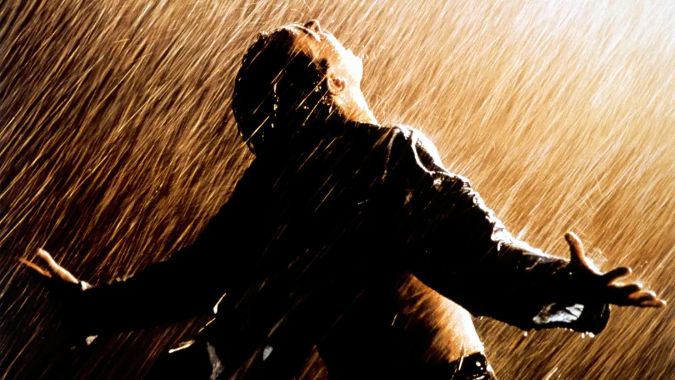 

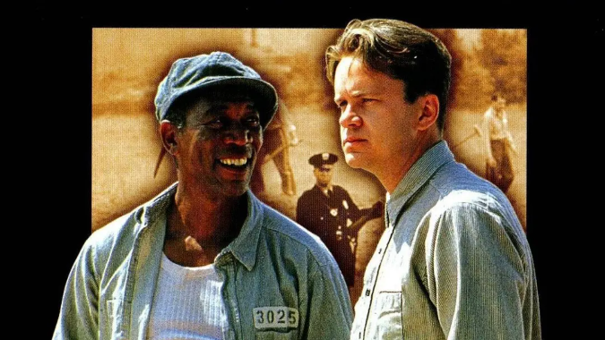 

> [查看全部壁纸](https://movie.douban.com/subject/1292052/photos?type=W)

---

## 音乐

### 原声带

**专辑名称**：The Shawshank Redemption (Original Motion Picture Soundtrack)

**作曲**：托马斯·纽曼 (Thomas Newman)

**发行日期**：1994年

**曲目列表**：

| 序号 | 曲名 | 时长 |
|------|------|------|
| 1 | Introduction | 0:04 |
| 2 | End Title | 3:34 |
| 3 | Shawshank Prison | 1:55 |
| 4 | Brooks Was Here | 2:41 |
| 5 | New Fish Arrive | 1:32 |
| 6 | Rock Hammer | 1:52 |
| 7 | An Innocent Man | 1:58 |
| 8 | The Moocher | 1:36 |
| 9 | Suds | 1:02 |
| 10 | Loafing | 1:06 |
| 11 | The Marriage of Figaro / Duettino - Sull'aria | 2:54 |
| 12 | Compass and Guns | 2:04 |
| 13 | The Riddle of Zihuatanejo | 1:25 |
| 14 | The Riddle Solved | 1:30 |
| 15 | The Tunnel | 1:30 |
| 16 | Freedom | 1:42 |

> [豆瓣音乐](https://music.douban.com/subject_search?search_text=Thomas%20Newman%20Shawshank)

---

## 相似作品（豆瓣推荐）

- 阿甘正传 (1994) - 豆瓣评分 9.5
- 楚门的世界 (1998) - 豆瓣评分 9.4
- 当幸福来敲门 (2006) - 豆瓣评分 9.1
- 活着 (1994) - 豆瓣评分 9.3
- 摔跤吧！爸爸 (2016) - 豆瓣评分 9.0
- 我不是药神 (2018) - 豆瓣评分 9.0
- 三傻大闹宝莱坞 (2009) - 豆瓣评分 9.2
- 心灵捕手 (1997) - 豆瓣评分 9.0
- 闻香识女人 (1992) - 豆瓣评分 9.1
- 这个杀手不太冷 (1994) - 豆瓣评分 9.4

---

## 精彩影评

### 影评 1

**来源**：豆瓣  
**作者**：如小果  
**时间**：2008-02-27  
**评分**：力荐  

恐惧让你沦为囚犯，希望让你重获自由。——《肖申克的救赎》

> [原文链接](https://movie.douban.com/review/xxxxx/)

---

### 影评 2

**来源**：豆瓣  
**作者**：犀牛  
**时间**：2005-10-28  
**评分**：力荐  

当年的奥斯卡颁奖礼上，被如日中天的《阿甘正传》掩盖了它的光彩，而随着时间的推移，这部电影在越来越多的人们心中的地位已超越了《阿甘》。每当现实令我疲惫得产生无力感，翻出这张碟，就重获力量。毫无疑问，本片位列男人必看的电影前三名！回顾那一段经典台词："有的人的羽翼是如此光辉，即使世界上最黑暗的牢狱，也无法长久地将他围困！"

> [原文链接](https://movie.douban.com/review/xxxxx/)

---

### 影评 3

**来源**：豆瓣  
**作者**：711|湯不餓  
**时间**：2010-03-27  
**评分**：力荐  

筹划了19年的私奔……

> [原文链接](https://movie.douban.com/review/xxxxx/)

---

### 影评 4

**来源**：豆瓣  
**作者**：艾小柯  
**时间**：2006-06-20  
**评分**：力荐  

关于希望最强有力的注释。

> [原文链接](https://movie.douban.com/review/xxxxx/)

---

### 影评 5

**来源**：豆瓣  
**作者**：Eve|Classified  
**时间**：2008-05-09  
**评分**：力荐  

"这是一部男人必看的电影。"人人都这么说。但单纯从性别区分，就会让这电影变狭隘。《肖申克的救赎》突破了男人电影的局限，通篇几乎充满令人难以置信的温馨基调，而电影里最伟大的主题是"希望"。

当我们无奈地遇到了如同肖申克一般囚禁了心灵自由的那种囹圄，我们是无奈的老布鲁克，灰心的瑞德，还是智慧的安迪？运用智慧，信任希望，并且勇敢面对恐惧心理，去打败它？

经典的电影之所以经典，因为他们都在做同一件事——深入探讨人性。

> [原文链接](https://movie.douban.com/review/xxxxx/)

---

## 关联链接

| 网站 | 链接 |
|------|------|
| 豆瓣电影 | https://movie.douban.com/subject/1292052/ |
| IMDb | https://www.imdb.com/title/tt0111161/ |
| TMDB | https://www.themoviedb.org/movie/278 |

---

## 系统信息

| 字段 | 值 |
|------|-----|
| ID | 0101000001 |
| 录入时间 | 2026-05-01 |
| 最后更新 | 2026-05-01 |
| 数据来源 | 豆瓣、OMDb |
