# 阿甘正传 Forrest Gump (1994)

**导演**：罗伯特·泽米吉斯

**编剧**：艾瑞克·罗斯 / 温斯顿·格鲁姆（原著）

**主演**：汤姆·汉克斯 / 罗宾·怀特 / 加里·西尼斯 / 麦凯尔泰·威廉逊 / 莎莉·菲尔德

**类型**：剧情 / 爱情

**制片国家/地区**：美国

**语言**：英语

**上映日期**：1994年7月6日(美国) / 1994年10月7日(英国) / 1994年12月15日(中国香港)

**片长**：142分钟

**又名**：福雷斯特·冈普

**IMDb**：tt0109830

**豆瓣评分**：**9.5** / 2,232,771人评价

**MPAA评级**：PG-13

**获奖**：Won 6 Oscars. 51 wins & 74 nominations total

---

阿甘（汤姆·汉克斯饰）是个智商只有75的低能儿。在学校里为了躲避别的孩子的欺侮，听从一个朋友珍妮（罗宾·怀特饰）的话而开始"跑"。他跑着躲避别人的捉弄。在中学时，他为了躲避别人而跑进了一所学校的橄榄球场，就这样跑进了大学。阿甘被破格录取，并成了橄榄球巨星，受到了肯尼迪总统的接见。

在大学毕业后，阿甘又应征入伍去了越南。在那里，他有了两个朋友：热衷捕虾的布巴和令人敬畏的长官邓·泰勒上尉。这时，珍妮已经堕落，过着放荡的生活。阿甘一直爱着珍妮，但珍妮却不爱他。在战争结束后，阿甘作为英雄受到了约翰逊总统的接见。在一次和平集会上，阿甘又遇见了珍妮，两人匆匆相遇又匆匆分手。在"说到就要做到"这一信条的指引下，阿甘最终闯出了一片属于自己的天空。在他的生活中，他结识了许多美国的名人。他告发了水门事件的窃听者，作为美国乒乓球队的一员到了中国，为中美建交立下了功劳。猫王和约翰·列侬这两位音乐巨星也是通过与他的交往而创作了许多风靡一时的歌曲。最后，阿甘通过捕虾成了一名企业家。为了纪念死去的布巴，他成立了布巴·甘公司，并把公司的一半股份给了布巴的母亲，自己去做一名园丁。

在隐居生活中，他时常思念珍妮。而这时的珍妮早已误入歧途，陷于绝望之中。终于有一天，珍妮回来了。她和阿甘共同生活了一段日子。在一天夜晚，珍妮投入了阿甘的怀抱，之后又在黎明悄然离去。醒来的阿甘木然坐在门前的长椅上，然后突然开始奔跑。他跑步横越了美国，又一次成了名人。在奔跑了许久之后，阿甘停了下来，开始回自己的故乡。在途中，收到了珍妮的信。他立刻去找她。在公交站台候车时，阿甘向他人讲述了他之前的经历。于是他又一次见到了珍妮，还有一个小男孩，那是他的儿子。这时的珍妮已经得了一种不治之症。阿甘和珍妮三人一同回到了家乡，一起度过了一段幸福的时光。珍妮过世了，他们的儿子也已到了上学的年纪。阿甘送儿子上了校车，坐在公共汽车站的长椅上，回忆起了他一生的经历。

---

## 演职员信息

### 导演

 
<strong>罗伯特·泽米吉斯</strong> 
<small>Robert Zemeckis</small>

**代表作**：回到未来、荒岛余生、云中行走

### 编剧

| 姓名 | 外文名 | 角色 |
|------|--------|------|
| 艾瑞克·罗斯 | Eric Roth | 编剧 |
| 温斯顿·格鲁姆 | Winston Groom | 原著 |

### 主演

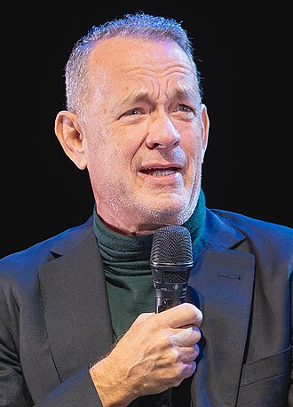 
<strong>汤姆·汉克斯</strong> 
<small>Tom Hanks</small> 
<small>饰 阿甘</small>

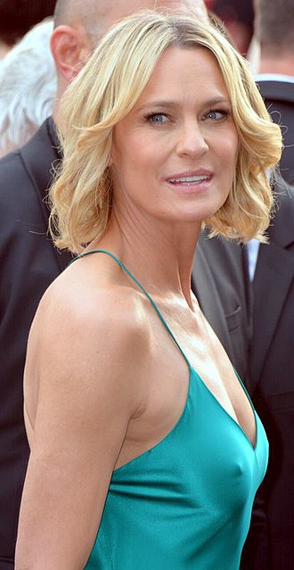 
<strong>罗宾·怀特</strong> 
<small>Robin Wright</small> 
<small>饰 珍妮·库伦</small>

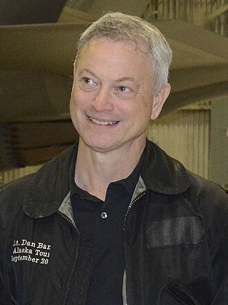 
<strong>加里·西尼斯</strong> 
<small>Gary Sinise</small> 
<small>饰 邓·泰勒</small>

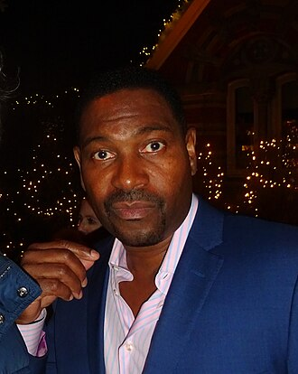 
<strong>麦凯尔泰·威廉逊</strong> 
<small>Mykelti Williamson</small> 
<small>饰 布巴·布鲁</small>

 
<strong>莎莉·菲尔德</strong> 
<small>Sally Field</small> 
<small>饰 甘普太太</small>

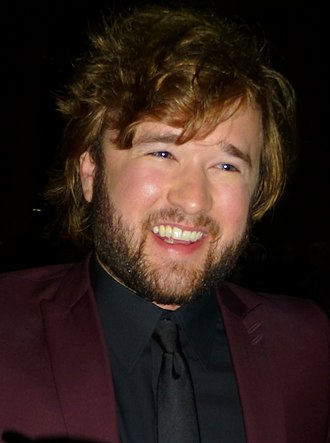 
<strong>海利·乔·奥斯蒙</strong> 
<small>Haley Joel Osment</small> 
<small>饰 小阿甘</small>

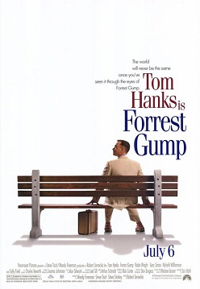 
<strong>迈克尔·康纳·汉弗莱斯</strong> 
<small>Michael Conner Humphreys</small> 
<small>饰 年幼阿甘</small>

<strong>汉娜·豪尔</strong> 
<small>Hanna R. Hall</small> 
<small>饰 年幼珍妮</small> 
<small style="color: #888;">（Wikipedia无头像）</small>

### 其他演员

| 姓名 | 外文名 | 饰演角色 |
|------|--------|----------|
| 库尔特·拉塞尔 | Kurt Russell | 艾维斯·普斯里（配音） |
| 彼得·多布森 | Peter Dobson | 猫王 |
| 索尼·施罗耶 | Sonny Shroyer | 布莱恩特教练 |

---

## 音乐

### 原声带

**专辑名称**：Forrest Gump: The Soundtrack

**作曲**：亚伦·史维斯查 (Alan Silvestri)

**发行日期**：1994

**曲目列表**：

| 序号 | 曲名 | 演唱者 |
|------|------|--------|
| 1 | Hound Dog | Elvis Presley |
| 2 | Rebel Rouser | Duane Eddy |
| 3 | (I Don't Know Why) But I Do | Clarence 'Frogman' Henry |
| 4 | Walk Right In | The Rooftop Singers |
| 5 | Land of 1000 Dances | Wilson Pickett |
| 6 | Blowin' in the Wind | Bob Dylan |
| 7 | Fortunate Son | Creedence Clearwater Revival |
| 8 | I Can't Help Myself (Sugar Pie Honey Bunch) | Four Tops |
| 9 | Respect | Aretha Franklin |
| 10 | Raindrops Keep Falling on My Head | B.J. Thomas |
| 11 | Sloop John B | The Beach Boys |
| 12 | California Dreamin' | The Mamas & The Papas |
| 13 | For What It's Worth | Buffalo Springfield |
| 14 | What the World Needs Now Is Love | Jackie DeShannon |
| 15 | Break On Through (To the Other Side) | The Doors |
| 16 | Mrs. Robinson | Simon & Garfunkel |
| 17 | Volunteers | Jefferson Airplane |
| 18 | Let's Get Together | Chet Powers |
| 19 | San Francisco (Be Sure to Wear Flowers in Your Hair) | Scott McKenzie |
| 20 | Turn! Turn! Turn! (To Everything There Is a Season) | The Byrds |
| 21 | Medley: Aquarius/Let the Sunshine In | The 5th Dimension |
| 22 | Everybody's Talkin' | Harry Nilsson |
| 23 | Joy to the World | Three Dog Night |
| 24 | Stoned Love | The Supremes |
| 25 | Rainy Day Women #12 & 35 | Bob Dylan |
| 26 | Mr. President (Have Pity on the Working Man) | Randy Newman |
| 27 | Sweet Home Alabama | Lynyrd Skynyrd |
| 28 | It Keeps You Runnin' | The Doobie Brothers |
| 29 | I've Got to Use My Imagination | Gladys Knight & The Pips |
| 30 | On the Road Again | Willie Nelson |
| 31 | Against the Wind | Bob Seger |
| 32 | Forrest Gump Suite | Alan Silvestri |

---

## 相似作品（豆瓣推荐）

| 片名 | 年份 | 豆瓣评分 |
|------|------|----------|
| 肖申克的救赎 | 1994 | 9.7 |
| 这个杀手不太冷 | 1994 | 9.4 |
| 美丽人生 | 1997 | 9.5 |
| 泰坦尼克号 | 1997 | 9.5 |
| 楚门的世界 | 1998 | 9.3 |

---

## 海报画廊

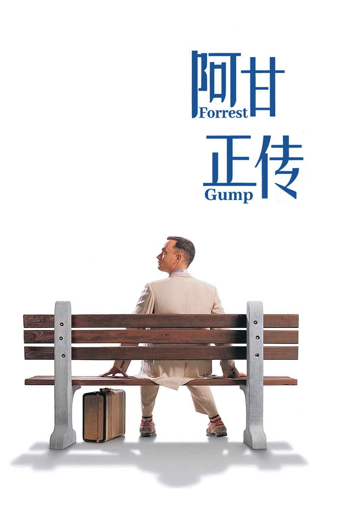
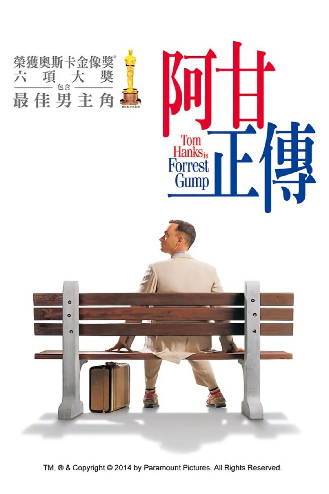
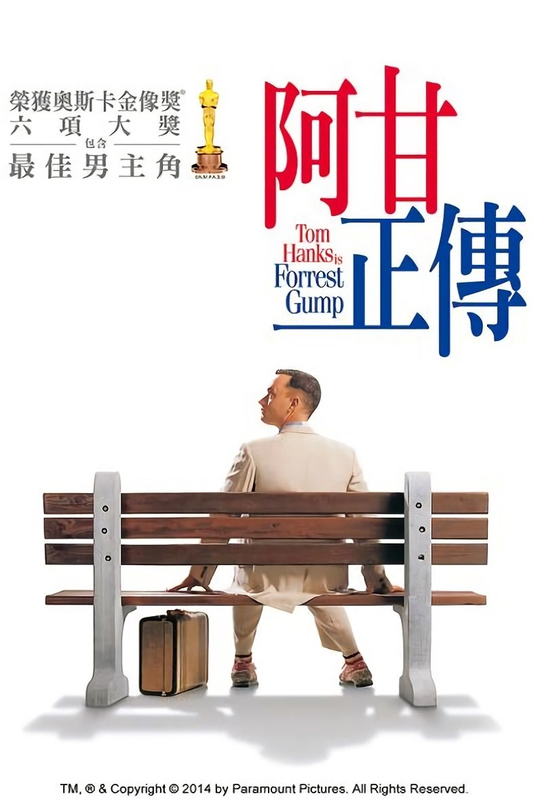
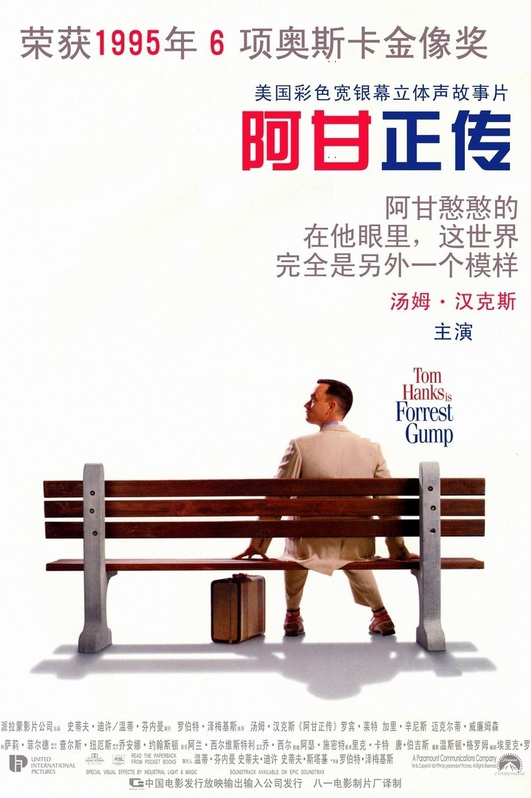
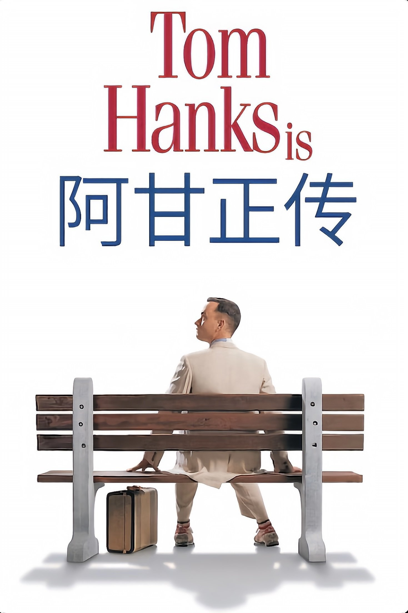
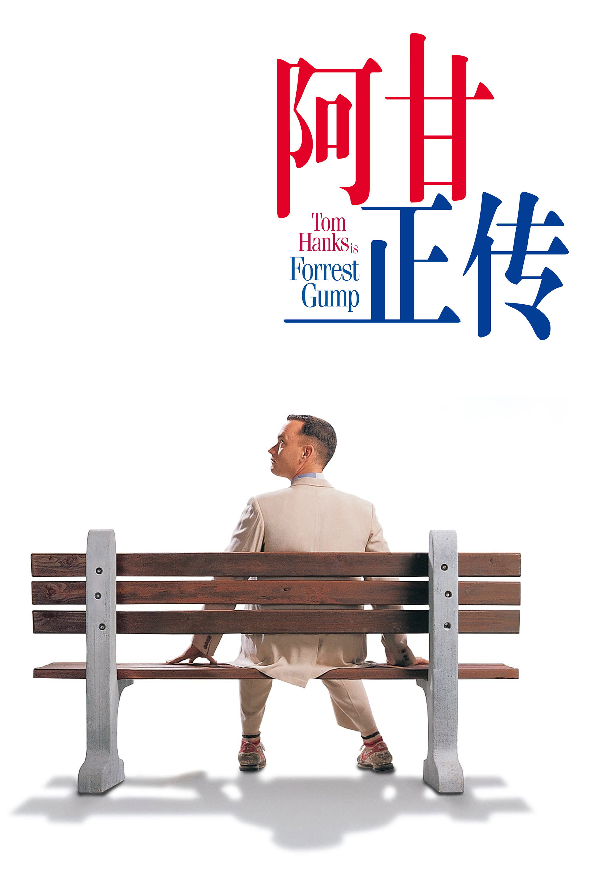
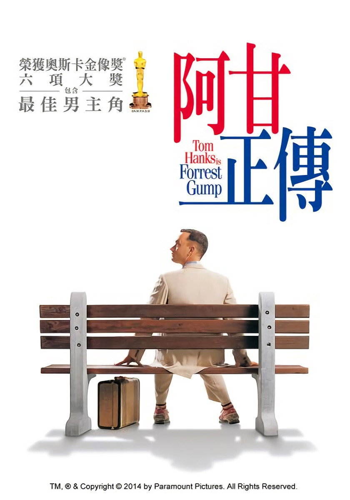
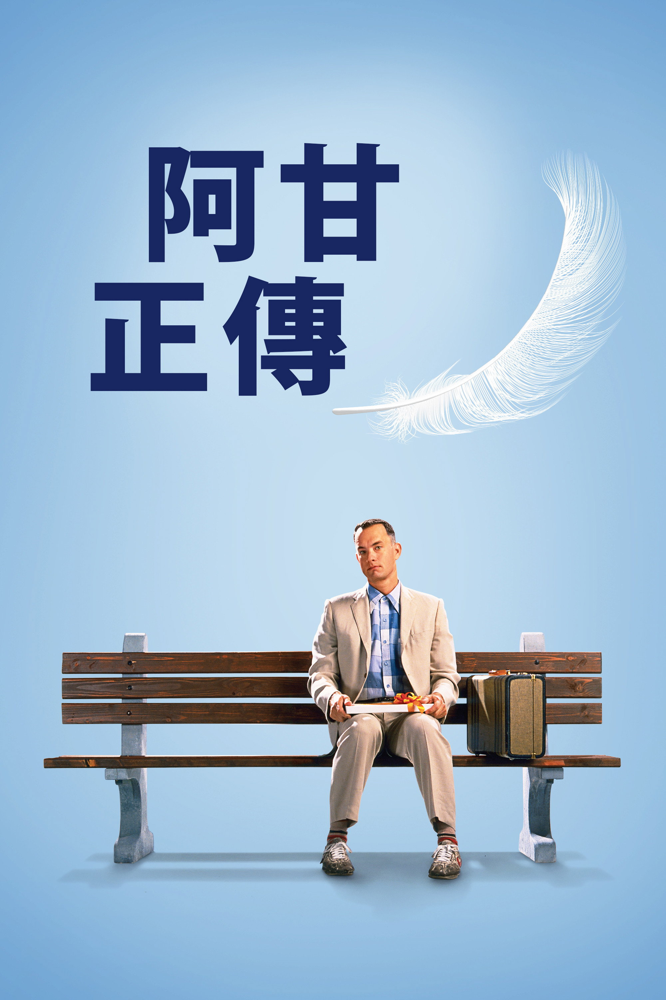
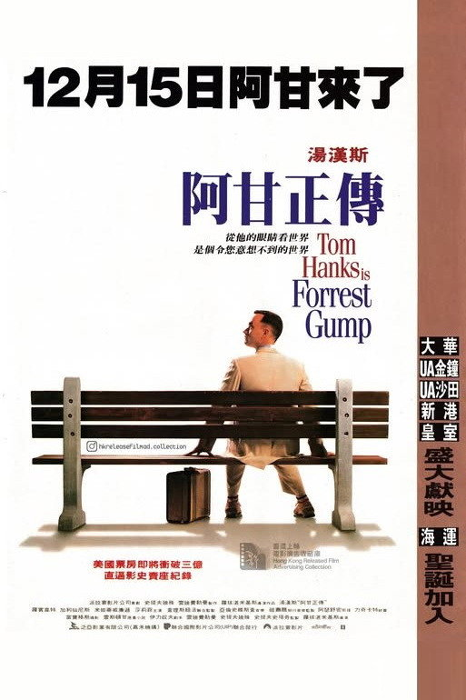
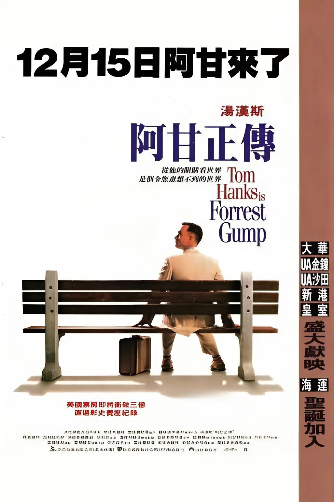

---

## 剧照精选

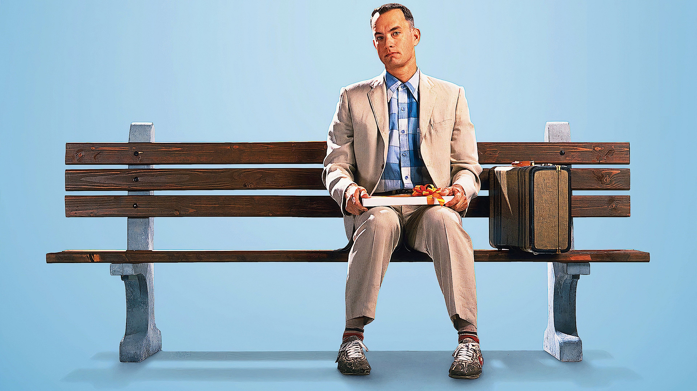
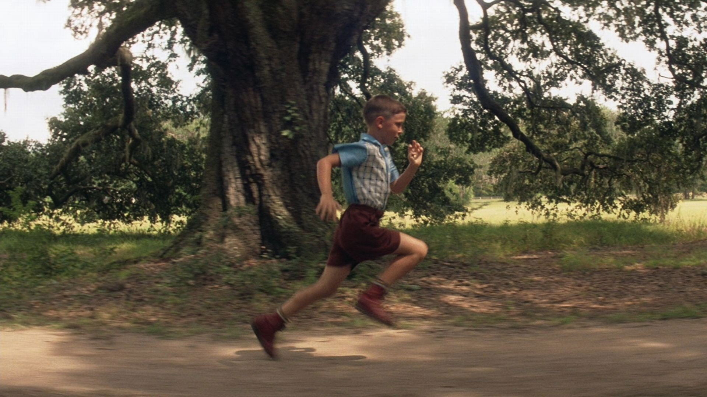

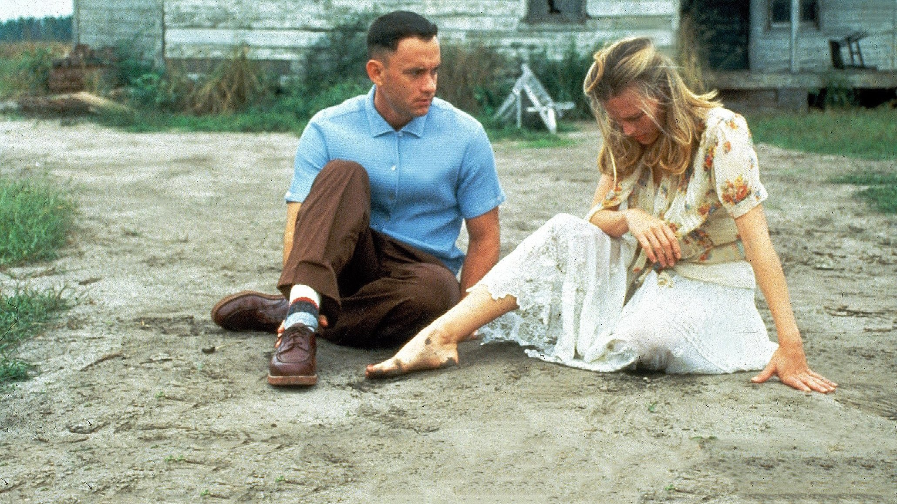
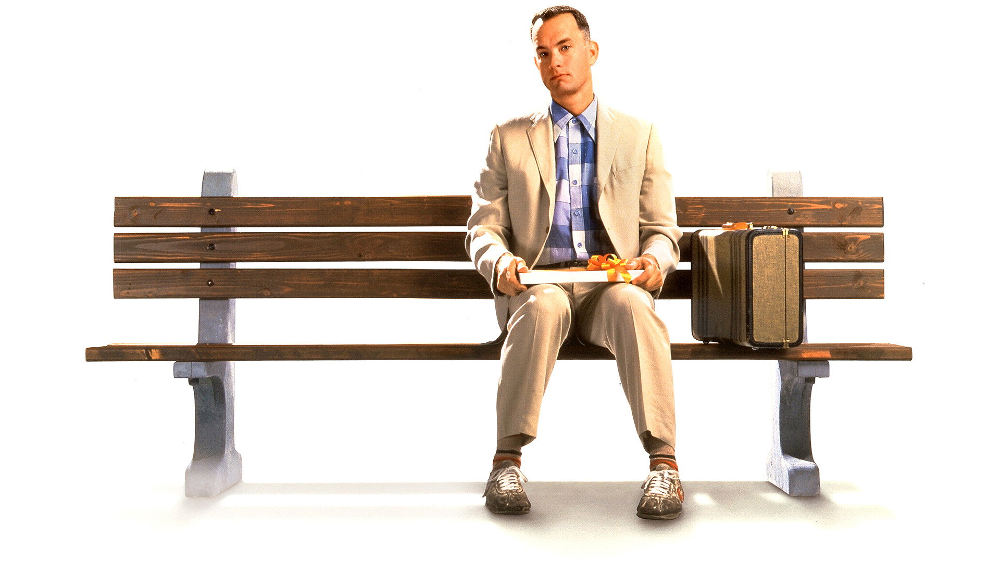

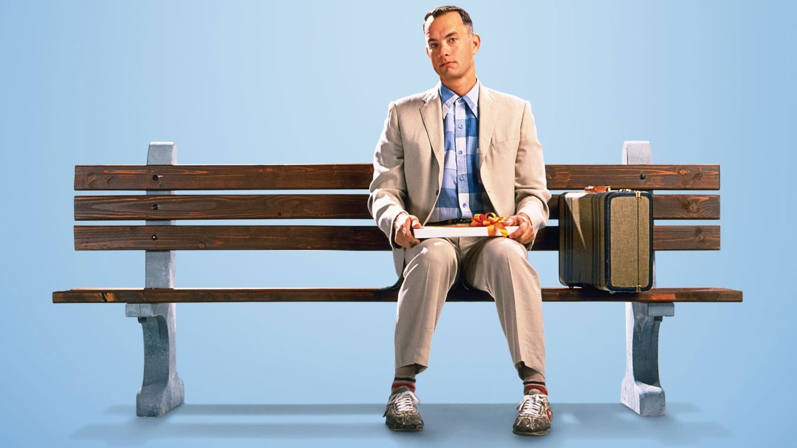

---

## 精彩影评

### 今天小熊不吃糖（2008-08-12）

> [力荐]
>
> 羡慕珍妮，不管她多么叛逆、落魄、堕落，永远有阿甘在等她回来

### 影志（2006-02-13）

> [力荐]
>
> 妈妈说，生活就像一盒巧克力……请不要再续下一句，耳朵听的起了茧子。

### 陳（2009-01-04）

> [推荐]
>
> 太甜美的美國夢

### 林愈静（2006-04-21）

> [力荐]
>
> 每年看一遍，每年哭一遍，看看自己幸福还是阿甘幸福！时间：从2003开始每年一遍

### 娜莉梦游仙境（2016-12-09）

> [力荐]
>
> 傻人有傻福，实际上并不是这样的。在我看来，阿甘的妈妈才是最伟大的人。很多普通人把低智商的孩子早早就放弃了，不让上学，不与别人接触，也许是为了保护自己的孩子，但是这样以后孩子就等于废了……

---

## 关联链接

- [豆瓣电影](https://movie.douban.com/subject/1292720/)
- [IMDb](https://www.imdb.com/title/tt0109830/)
- [TMDB](https://www.themoviedb.org/movie/13)

---

## 数据来源说明

**数据来源**：OMDb、百度百科、Wikipedia

**字段溯源**：见 source.json

**图片统计**：
- 海报：11张（1张主海报 + 10张 TMDB）
- 剧照：39张（TMDB backdrops）
- 头像：8张（Wikipedia），1张缺失（Hanna R. Hall）

**数据来源**：
- 基本信息：OMDb、百度百科、Wikipedia
- 海报/剧照：TMDB（自动化爬取）
- 影评：豆瓣用户短评（Cookie 登录获取）

**缺失字段**：
- Hanna R. Hall 头像 - Wikipedia无此演员头像页面
- 视频预告片 - TMDB视频页面动态渲染，暂未获取

---

## 系统信息

- 录入时间：2026-05-01
- 最后更新：2026-05-01
- 系统ID：0101000003
- 模块：video/movie
