# 霸王别姬 Farewell My Concubine (1993)

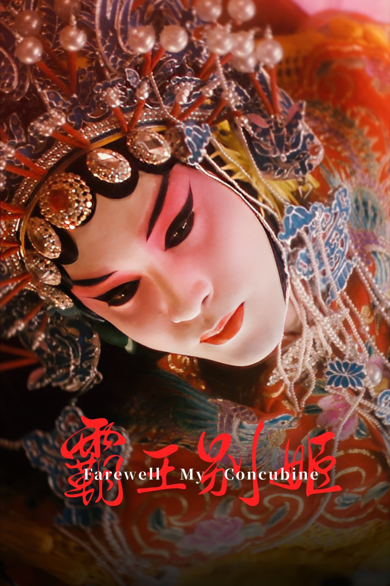

**导演**：陈凯歌

**编剧**：芦苇 / 李碧华

**主演**：张国荣 / 张丰毅 / 巩俐 / 葛优 / 英达

**类型**：剧情 / 爱情 / 同性

**制片国家/地区**：中国大陆 / 中国香港

**语言**：汉语普通话

**上映日期**：1993年7月26日(中国大陆) / 1993年1月1日(中国香港)

**片长**：171分钟

**又名**：再见，我的妾 / Farewell My Concubine / Adieu Ma Concubine

**IMDb**：tt0106332

**豆瓣评分**：**9.6** / 2,421,261人评价

**MPAA评级**：R

**获奖**：Nominated for 2 Oscars. 24 wins & 12 nominations total

---

## 剧情简介

程蝶衣与段小楼自幼在梨园一同长大，凭《霸王别姬》名满京城，却因对戏与人生的不同理解走向分裂。

当菊仙闯入二人关系，时代风云又不断改写命运，一场跨越半生的情感纠葛最终把舞台、欲望与历史一并推向悲剧。

---

## 详情介绍

上世纪二十年代的北平，妓女出身的母亲为了让小豆子有口饭吃，把他送进严苛的戏班。为了符合学戏规矩，小豆子被硬生生切去多出的手指，从此与小石头一起在关师傅门下受尽打骂与规训。小豆子天生适合旦角，却始终抗拒“我本是女娇娥”的唱词；经历逃班、小癞子之死与长期驯化后，他终于把“程蝶衣”这层身份唱进骨血，也把戏台人生与现实人生逐渐混为一体。

成年后的程蝶衣与段小楼凭《霸王别姬》红遍京城，一个演虞姬，一个演霸王，台上台下都像命定搭档。蝶衣把“一辈子差一年、一个月、一天、一个时辰都不算一辈子”当成誓言，对师兄、对戏、对自我身份都投入了近乎宗教般的执念。段小楼却始终把唱戏当营生，把台上情义和台下生活分得更开。

名妓菊仙的出现打破了这段微妙平衡。段小楼与菊仙成婚后，蝶衣把她视作闯入者，也第一次真正感到被背叛。与此同时，袁四爷这样的戏迷与权势人物不断介入，使蝶衣在被欣赏、被占有与自我献祭之间越陷越深。抗战、日本投降、政权更替接连到来，三人的关系也在不同历史时刻被迫重新站队、相互伤害。

新中国成立后，他们一度迎来短暂稳定，但旧日恩怨和角色错位并未真正结束。到文革时期，昔日名角在群众批斗中被推上审判席，为了自保彼此揭短、互相刺伤。段小楼否认与蝶衣的深情，蝶衣也说出菊仙最无法承受的真相，最终逼得菊仙在绝望中自尽。曾经把戏唱到极致的三个人，至此都被时代和自身选择彻底碾碎。

十一年后，程蝶衣与段小楼再度同台《霸王别姬》。当熟悉的唱段重新响起，蝶衣终于以虞姬的方式完成了自己与舞台、与霸王、与一生执念的最后合一，在戏里戏外都走向了真正的诀别。

---

## 演职员信息

### 导演

 
<strong>陈凯歌</strong> 
<small>Chen Kaige</small>

### 编剧

| 姓名 | 外文名 | 角色 |
|------|--------|------|
| 芦苇 | Wei Lu | 编剧 |
| 李碧华 | Lilian Lee Pik-Wah | 原著/编剧 |

### 主演

 
<strong>张国荣</strong> 
<small>Leslie Cheung</small> 
<small>饰 程蝶衣</small>

 
<strong>张丰毅</strong> 
<small>Zhang Fengyi</small> 
<small>饰 段小楼</small>

 
<strong>巩俐</strong> 
<small>Gong Li</small> 
<small>饰 菊仙</small>

 
<strong>葛优</strong> 
<small>Ge You</small> 
<small>饰 袁四爷</small>

 
<strong>英达</strong> 
<small>Ying Da</small> 
<small>饰 那坤</small>

 
<strong>蒋雯丽</strong> 
<small>Jiang Wenli</small> 
<small>饰 小豆子娘</small>

 
<strong>吴大维</strong> 
<small>David Wu</small> 
<small>饰 红卫兵</small>

 
<strong>吕齐</strong> 
<small>Qi Lu</small> 
<small>饰 关师傅</small>

### 其他演员

| 姓名 | 外文名 | 饰演角色 |
|------|--------|----------|
| 雷汉 | Han Lei | 小四(成年) |
| 童弟 | Tong Di | 张公公 |
| 尹治 | Yin Zhi | 小豆子(少年) |
| 马明威 | Ma Mingwei | 小豆子(童年) |
| 费振翔 | Zhenxiang Fei | 小石头(童年) |
| 赵海龙 | Zhao Hailong | 小石头(少年) |

---

## 视频

<a href="https://www.youtube.com/watch?v=FFiHfDBt9lE">
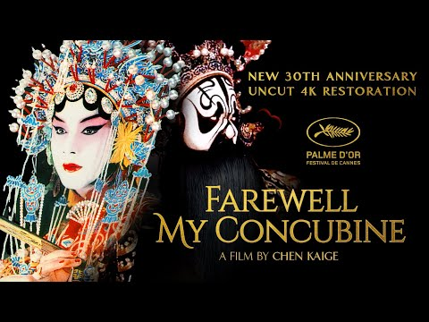 
<strong>Trailer</strong> 
<small>01:34</small>
</a>

---

## 相似作品（豆瓣推荐）

| 片名 | 年份 | 豆瓣评分 |
|------|------|----------|
| 活着 | 1994 | 9.3 |
| 春光乍泄 | 1997 | 9.0 |
| 楚门的世界 | 1998 | 9.4 |
| 重庆森林 | 1994 | 8.8 |
| 罗马假日 | 1953 | 9.1 |
| 花样年华 | 2000 | 8.8 |

---

## 海报画廊

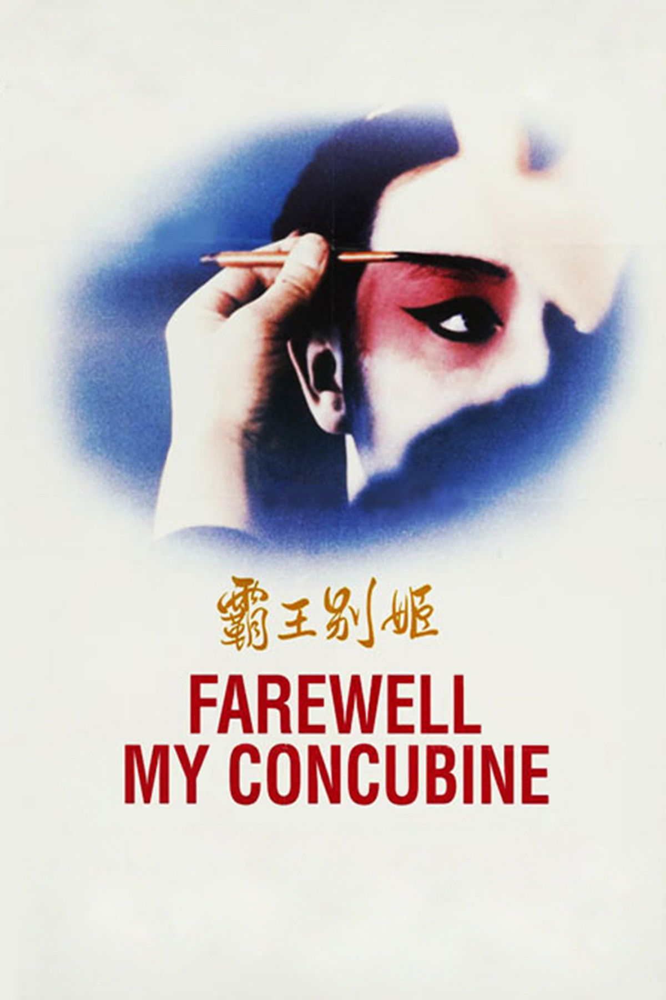
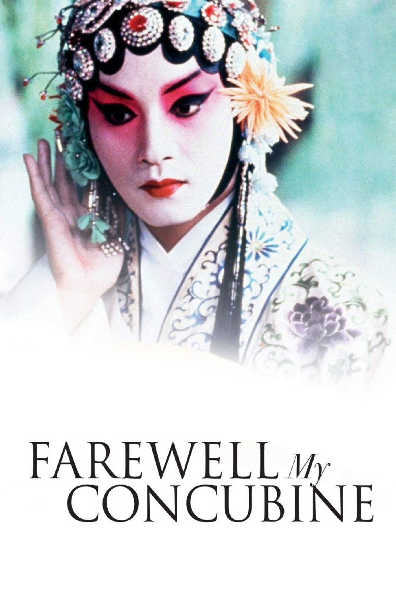
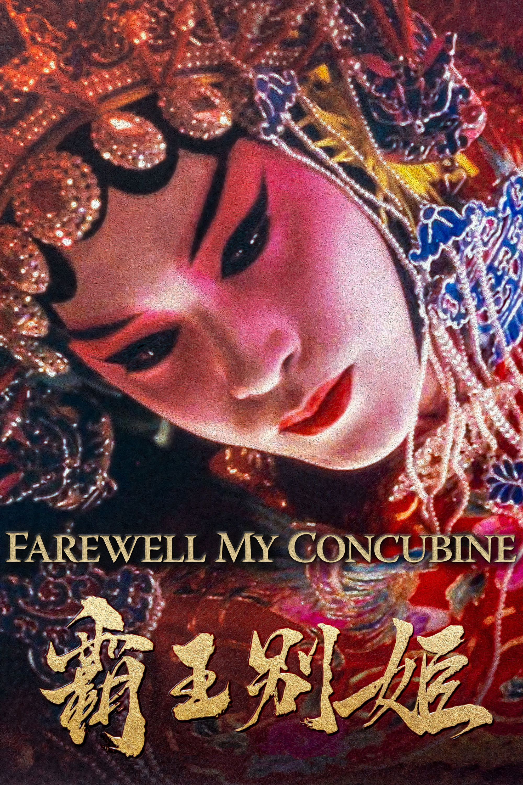
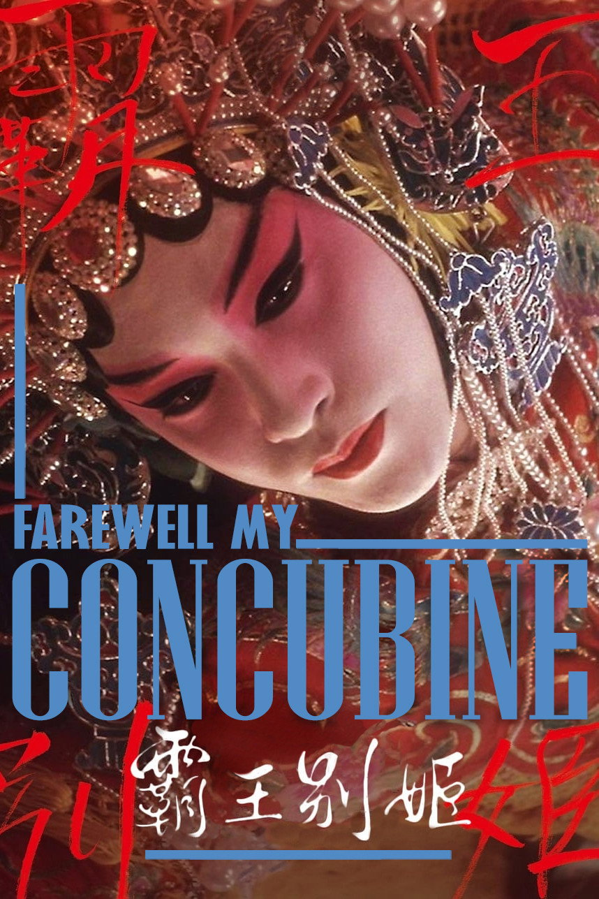
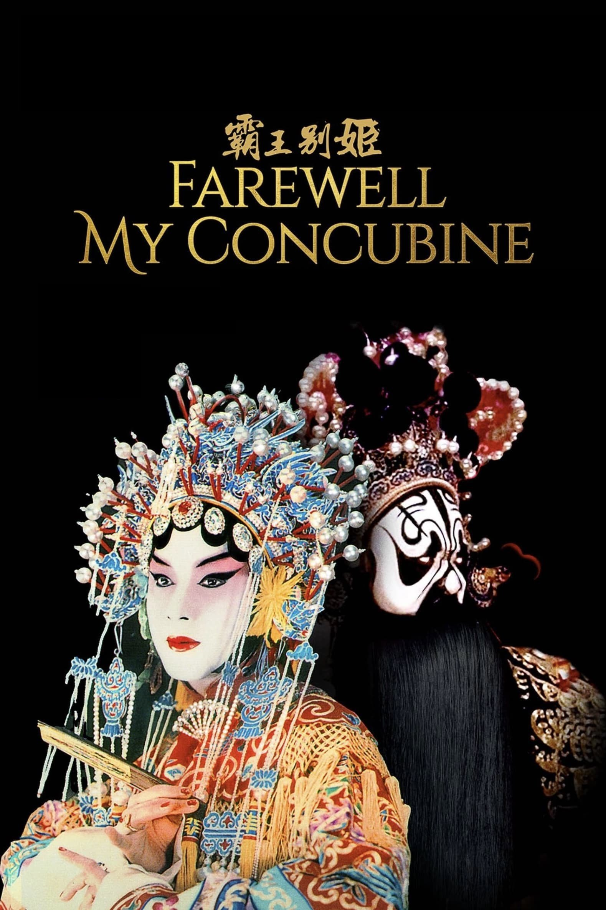

---

## 剧照精选

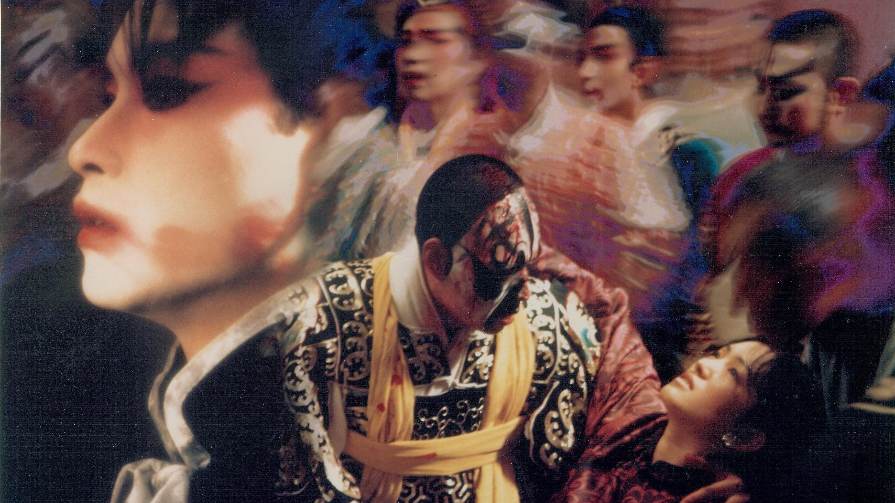
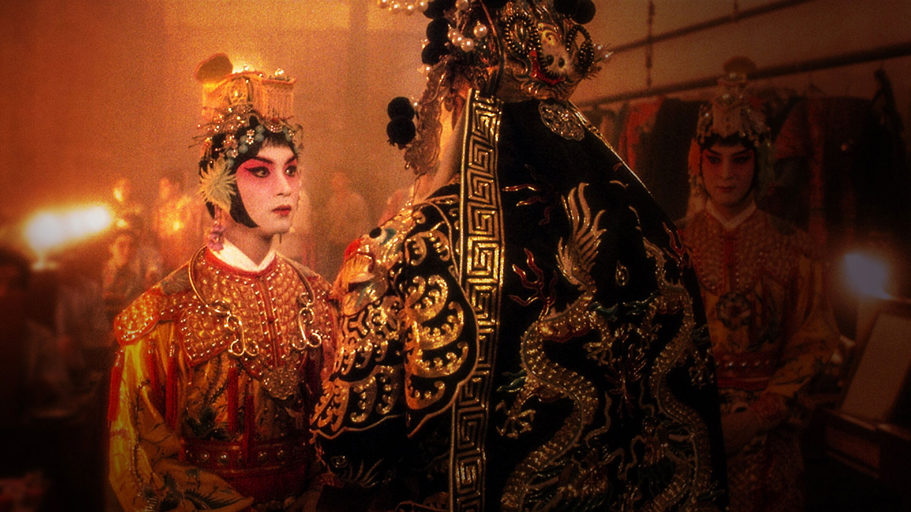
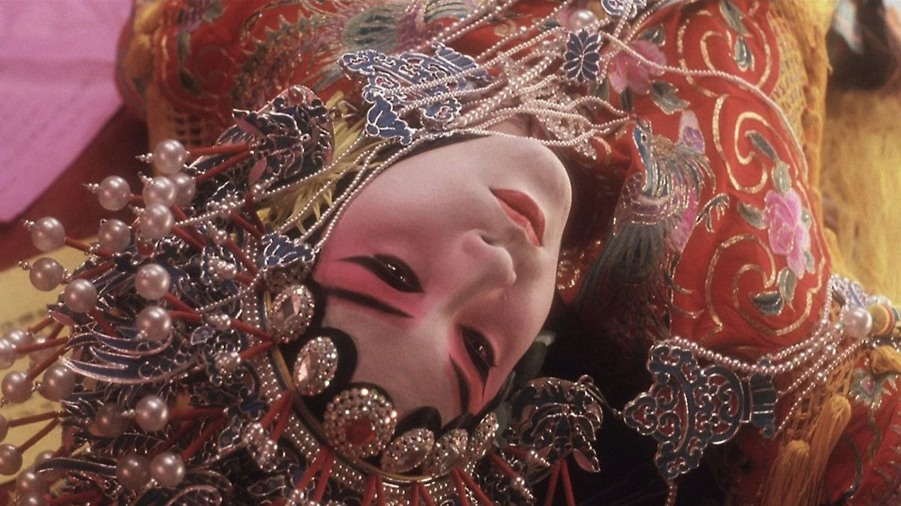
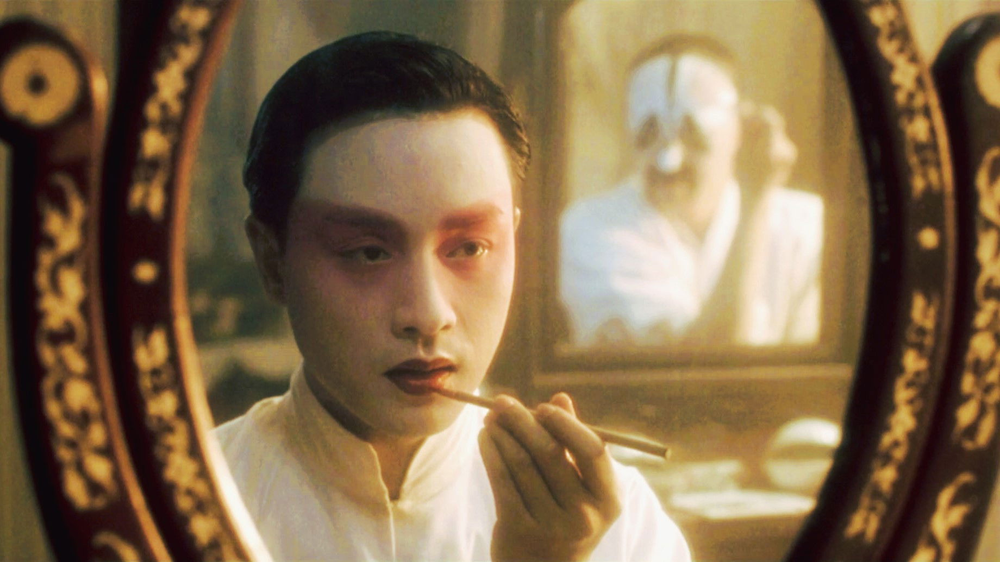
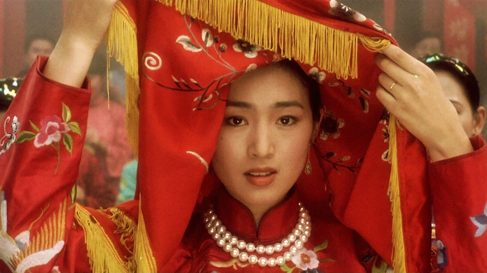

---

## 精彩影评

### 陈野犁（2008-05-15）

《霸王别姬》最厉害的地方，不只是把一段梨园旧梦拍得华丽，而是让戏与人、爱与欲、时代与命运层层缠绕。程蝶衣不是单纯地活在戏里，而是在被命运反复撕裂之后，只剩下戏还能容纳他的全部真心。

### psyduck（2006-02-14）

程蝶衣与段小楼的关系从戏班时代起就带着极深的依附与错位：一个把台上的誓言当成一生，一个始终想把戏和生活分开。影片真正残忍之处，在于这份感情既撑起了他们的艺术巅峰，也注定会在现实世界里一步步走向崩塌。

### 阿底（2006-06-02）

在看这部电影之前，很容易对国产电影抱有偏见；但《霸王别姬》会迅速把这种傲慢击碎。它的大手笔不只是制作层面的精致，而是敢于把迷恋、背叛、欲望和历史灾难同时放进人物命运里，让每一次相爱与相弃都带着时代的回声。

### 从嘉（2008-04-19）

小豆子被切去手指、被迫改口唱词的过程，不只是残酷训练，更像一场被强行完成的身份塑造。等到程蝶衣终于活成虞姬，他已经无法再把舞台当成表演，而只能把现实当成戏来承受；这正是影片最令人心惊的地方。

---

## 关联链接

- [豆瓣电影](https://movie.douban.com/subject/1291546/)
- [IMDb](https://www.imdb.com/title/tt0106332/)
- [TMDB](https://www.themoviedb.org/movie/10997)

---

## 数据来源说明

**数据来源**：豆瓣、TMDB、OMDb

**字段溯源**：见 source.json

**图片统计**：
- 海报：6张（1张主海报 + 5张 TMDB）
- 剧照：5张（TMDB backdrops）
- 头像：10张（TMDB）

**数据来源**：
- 基本信息、评分、简介、短评、相似推荐：豆瓣
- 英文名、IMDb评分、评级、获奖：OMDb
- 海报、剧照、头像、预告片：TMDB

**缺失字段**：
- 原声带专辑与曲目：本次未获取到稳定来源，暂未写入
- 壁纸：未获取到可确认来源，保持空数组

---

## 系统信息

- 录入时间：2026-05-02
- 最后更新：2026-05-02
- 系统ID：0101000004
- 模块：video/movie
